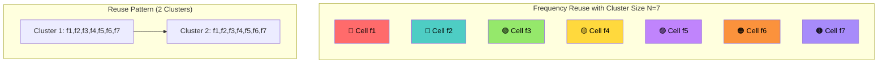
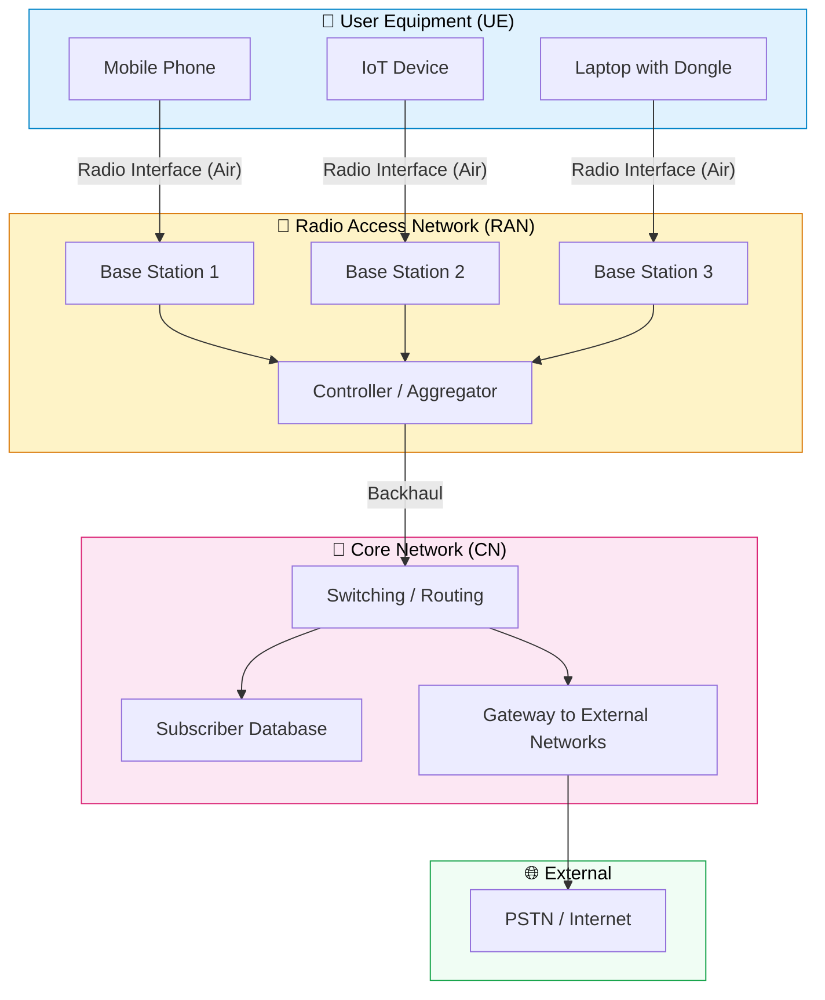
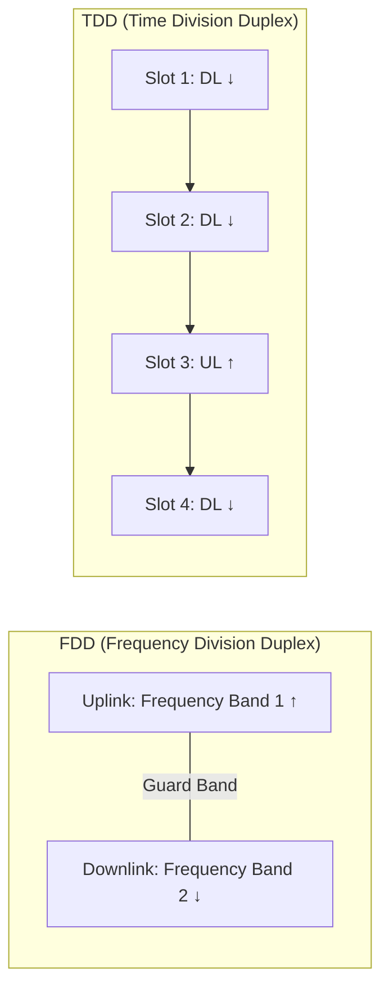
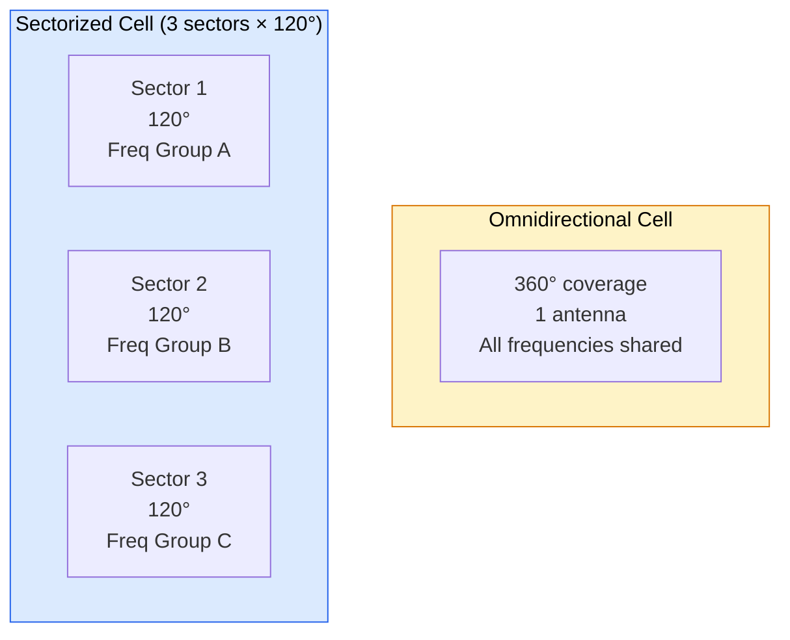

> **Links:** [README](./README.md) | [2G GSM →](./01-2G-GSM.md)

# 📡 Cellular Fundamentals

## What is Cellular Communication?

🎯 **Interview Favourite:** "Explain the cellular concept."

Imagine a city needs a phone network for millions of people, but you only have a limited number of radio frequencies (channels). You can't give every person a unique frequency — there aren't enough. The brilliant solution? **Divide the city into small zones called cells**, each with its own base station, and **reuse the same frequencies** in cells that are far enough apart so they don't interfere with each other.

> **Analogy — The Pizza Delivery Model:**  
> Think of a pizza chain. Instead of one giant kitchen serving the whole city (which would be impossibly slow and the delivery radius too large), you open many small outlets — each serving its own neighbourhood. Two outlets far apart can even have the same phone number without confusion, because customers only call their local outlet. That's exactly how cellular networks work — same frequencies reused in geographically separated cells.

**Why "cellular"?** Because the coverage area is divided into *cells*, like the cells of a honeycomb.

### Key Principles

| Principle | What It Means | Why It Matters |
|---|---|---|
| **Frequency Reuse** | Same frequencies used in non-adjacent cells | Multiplies system capacity without needing more spectrum |
| **Cell Splitting** | Large cells divided into smaller ones | Increases capacity in high-demand areas |
| **Handover** | Seamless transfer between cells | Enables mobility — calls don't drop when you move |
| **Low Power** | Each cell uses low transmit power | Reduces interference, enables frequency reuse |

---

## The Cell Concept & Frequency Reuse

### Hexagonal Cell Model

In theory, a base station antenna radiates in all directions, creating a circular coverage area. But circles leave gaps or overlap when tiled. So for planning purposes, engineers use **hexagons** — the most efficient shape that tiles a plane without gaps, closely approximating a circle.



### 🎯 Frequency Reuse Formula

$$D/R = \sqrt{3N}$$

| Symbol | Meaning |
|---|---|
| **D** | Distance between cells using the **same** frequency (co-channel distance) |
| **R** | Radius of each cell |
| **N** | Cluster size (number of cells before frequencies repeat) |

**Why does this formula matter?** It defines the trade-off between **capacity** and **interference**:

| Cluster Size (N) | D/R Ratio | Capacity | Co-Channel Interference |
|---|---|---|---|
| 3 | 3.0 | 🟢 Highest (each cell gets 1/3 of total channels) | 🔴 Worst |
| 4 | 3.46 | Good | Moderate |
| 7 | 4.58 | Moderate | Low |
| 12 | 6.0 | 🔴 Lowest (each cell gets 1/12 of total channels) | 🟢 Best |

> **Intuition:** Smaller N = more channels per cell = more capacity, BUT cells using the same frequency are closer together = more interference. It's a balancing act. GSM typically uses **N = 4 or 7**.

### Valid Cluster Sizes

Not just any number works. Valid cluster sizes follow: **N = i² + ij + j²** where i, j are non-negative integers.

Valid values: **1, 3, 4, 7, 9, 12, 13, 16, 19, 21...**

---

## Network Architecture — The Three Layers

Every mobile network, from 2G to 5G, follows a three-layer architecture:



| Layer | 2G Name | 3G Name | 4G Name | 5G Name | Role |
|---|---|---|---|---|---|
| **UE** | MS (Mobile Station) | UE | UE | UE | The user's device |
| **RAN** | BSS (BTS + BSC) | UTRAN (NodeB + RNC) | E-UTRAN (eNodeB) | NG-RAN (gNodeB) | Radio transmission & reception |
| **Core** | NSS (MSC, HLR...) | CN (MSC, SGSN, GGSN) | EPC (MME, SGW, PGW) | 5GC (AMF, SMF, UPF) | Switching, routing, authentication, billing |

> **Analogy:** Think of it like the postal system:
> - **UE** = You (the person writing/receiving mail)
> - **RAN** = Your local post office (collects and distributes mail in your area)
> - **Core Network** = The central sorting hub and national network (routes mail across the country and internationally)

---

## Multiple Access Technologies

🎯 **Interview Favourite:** "Compare FDMA, TDMA, CDMA, and OFDMA."

The radio spectrum is a shared, limited resource. Multiple access is HOW multiple users share it simultaneously.

### Intuitive Analogies

| Technology | Analogy | How It Works |
|---|---|---|
| **FDMA** | 🎵 **Radio stations** — each station gets its own frequency | Divide the band into narrow frequency channels; one user per channel |
| **TDMA** | ⏱️ **Time-sharing a meeting room** — each person gets a 15-min slot | All users share the same frequency but take turns in time slots |
| **CDMA** | 🗣️ **A multilingual party** — everyone speaks simultaneously but in different languages; you tune in to your language | All users share the same frequency AND time, distinguished by unique codes |
| **OFDMA** | 🏗️ **Multiple narrow conveyor belts** — each user gets a few belts; belts can be reassigned dynamically | Divide the band into many narrow sub-carriers; assign groups of sub-carriers to users |
| **SC-FDMA** | 🏗️ **Single wide conveyor belt per user** — less power variation | Like OFDMA but each user's data goes through a DFT pre-coding step, reducing PAPR |

### Detailed Comparison Table

| Feature | FDMA | TDMA | CDMA | OFDMA | SC-FDMA |
|---|---|---|---|---|---|
| **Used In** | 1G AMPS | 2G GSM | 3G UMTS (WCDMA) | 4G LTE (DL) | 4G LTE (UL) |
| **Sharing Dimension** | Frequency | Time | Code | Freq + Time | Freq + Time |
| **Channel Width** | 30 kHz (AMPS) | 200 kHz (GSM) | 5 MHz (UMTS) | 1.4–20 MHz | 1.4–20 MHz |
| **Bandwidth Efficiency** | Low | Medium | High | Very High | Very High |
| **Guard Requirement** | Guard bands | Guard time | None (codes orthogonal) | Cyclic prefix | Cyclic prefix |
| **Flexibility** | Rigid | Moderate | Good | Excellent | Excellent |
| **PAPR** | Low | Low | Low | High | 🟢 Low (why used for UL) |
| **Complexity** | Simple | Moderate | High | High | High |

> **Why SC-FDMA for uplink?** Mobile phones run on batteries. High PAPR (Peak-to-Average Power Ratio) means the amplifier needs to handle big power spikes → wastes battery. SC-FDMA has lower PAPR, so it's kinder to your phone's battery. The base station has mains power, so it can afford OFDMA's higher PAPR on the downlink.

---

## Modulation Schemes

🎯 **Interview Favourite:** "What's the trade-off between modulation order and robustness?"

Modulation is how we encode digital bits onto a radio wave (the carrier). Higher-order modulation packs more bits per symbol but requires a cleaner signal (higher SNR).

> **Analogy — The Alphabet Size:** Imagine communicating by holding up cards. With 2 cards (0, 1), you send 1 bit per show — easy to read from far away. With 256 cards, you send 8 bits per show — super fast, but the cards look similar, so you need to be close and the lighting must be perfect. That's exactly the modulation trade-off.

| Modulation | Constellation Points | Bits/Symbol | Min SNR (approx) | Used In | Robustness |
|---|---|---|---|---|---|
| **BPSK** | 2 | 1 | ~0 dB | Control channels, poor conditions | 🟢 Most robust |
| **QPSK** | 4 | 2 | ~3 dB | 3G, LTE cell edge | 🟢 Robust |
| **8-PSK** | 8 | 3 | ~7 dB | EDGE (2.75G) | 🟡 Moderate |
| **16-QAM** | 16 | 4 | ~10 dB | LTE, 5G mid-range | 🟡 Moderate |
| **64-QAM** | 64 | 6 | ~16 dB | LTE, 5G good conditions | 🟠 Sensitive |
| **256-QAM** | 256 | 8 | ~22 dB | LTE-A, 5G excellent conditions | 🔴 Very sensitive |

> **Key Insight:** Modern networks use **Adaptive Modulation and Coding (AMC)** — the modulation scheme changes dynamically based on channel quality. Close to the tower with clear line-of-sight? You get 256-QAM and blazing speeds. At the cell edge in a building? You drop to QPSK, slower but reliable.

### Why QAM and Not Just PSK?

- **PSK** (Phase Shift Keying): Only changes the *phase* of the signal. Works well up to 8-PSK, but at 16-PSK the constellation points are too close together.
- **QAM** (Quadrature Amplitude Modulation): Changes *both* phase and amplitude. This spreads constellation points more evenly, making them easier to distinguish. That's why 16-QAM and above use QAM, not PSK.

---

## Duplex Methods: FDD vs TDD

🎯 **How do uplink (UE → tower) and downlink (tower → UE) share the spectrum?**



| Feature | FDD | TDD |
|---|---|---|
| **Separation** | Frequency (paired bands) | Time (same frequency, alternating DL/UL) |
| **Spectrum Requirement** | Paired spectrum (2 × bandwidth) | Unpaired spectrum (1 × bandwidth) |
| **Latency** | 🟢 Lower (simultaneous UL/DL) | 🟡 Slightly higher (must wait for your slot) |
| **Asymmetric Traffic** | 🟡 Fixed UL/DL ratio | 🟢 Flexible — can assign more slots to DL for browsing |
| **Spectrum Cost** | 🔴 More expensive (paired bands are scarce) | 🟢 Cheaper (unpaired spectrum available) |
| **Guard Requirement** | Guard band between UL & DL frequencies | Guard period between DL→UL switch |
| **Coverage** | 🟢 Better for macro cells | 🟡 Better for small cells (timing issues at large distances) |
| **Used In** | 2G, 3G, LTE Band 1/3/7... | TD-LTE Band 38/40/41, 5G NR (most new spectrum) |
| **Channel Reciprocity** | ❌ No (different frequencies) | ✅ Yes (same frequency → enables beamforming) |

> **Trend:** 5G heavily uses TDD because most new spectrum (especially mmWave and mid-band like 3.5 GHz) is unpaired. TDD's channel reciprocity also enables **Massive MIMO beamforming**.

---

## Handover (Handoff) Basics

🎯 **Interview Favourite:** "Explain hard handover vs soft handover."

Handover is the process of transferring an ongoing call/session from one cell to another as the user moves.

> **Analogy:** Imagine swinging between vines in a jungle (like Tarzan).
> - **Hard Handover** = You **let go** of the first vine *before* grabbing the next one. Brief moment of "nothing" (break-before-make). Used in GSM, LTE.
> - **Soft Handover** = You grab the next vine *while still holding* the first one. Smooth, no gap (make-before-break). Used in 3G UMTS.

| Handover Type | Description | Break in Connection? | Used In |
|---|---|---|---|
| **Hard Handover** | UE disconnects from old cell, then connects to new cell | Yes (brief ~40ms) | GSM, LTE |
| **Soft Handover** | UE connected to 2+ cells simultaneously (active set) | No — seamless | UMTS (CDMA allows this) |
| **Softer Handover** | Soft handover between sectors of the *same* NodeB | No | UMTS |
| **Inter-RAT Handover** | Handover between different technologies (e.g., LTE → 3G) | Yes | LTE ↔ UMTS, 5G ↔ LTE |

**Why can CDMA do soft handover but GSM can't?**  
In CDMA, all cells use the *same frequency*. So the UE can listen to multiple cells simultaneously — they're separated by codes, not frequencies. In GSM (FDMA/TDMA), adjacent cells use *different frequencies*, so the UE's single receiver can only tune to one at a time.

---

## Cell Planning

### Coverage vs. Capacity

| Scenario | Cell Size | Goal | Example |
|---|---|---|---|
| **Rural** | Large (macro cells, 5–35 km radius) | Maximize **coverage** area | Highways, farmland |
| **Urban** | Small (micro/pico, 0.2–2 km) | Maximize **capacity** (users per km²) | City centres, malls |

### Cell Splitting

When a cell gets congested, **split it into smaller cells**. Each smaller cell has:
- Lower transmit power (to avoid interference with neighbours)
- Its own base station
- The same frequency reuse pattern, but at a smaller scale

> **Result:** Capacity roughly **quadruples** when you split a cell into 4 (since each mini-cell serves fewer users with the same number of channels).

### Sectorization

Instead of an omnidirectional antenna, use **directional antennas** that divide the cell into sectors — typically **3 sectors of 120°** each.



| Aspect | Omnidirectional | 3-Sector |
|---|---|---|
| Antennas | 1 | 3 |
| Capacity Gain | Baseline | ~3× (each sector reuses full channel set with reduced interference) |
| Cost | Lower | Higher (more antennas, feeders) |
| Interference | Higher (radiates in all directions) | Lower (directional → less interference to neighbours) |

### Antenna Tilt

Tilting the antenna beam downward controls the cell's coverage footprint:

| Tilt Type | How | Adjustable? | Typical Use |
|---|---|---|---|
| **Mechanical Tilt** | Physically angle the antenna downward | Manual (technician climbs tower) | Initial deployment |
| **Electrical Tilt** | Adjust phase of antenna elements electronically | Remote (via software) — **RET** | Day-to-day optimization |

> **Why tilt?** To reduce interference to neighbouring cells and to concentrate signal where users actually are (on the ground, not the sky!). Over-tilting shrinks coverage; under-tilting causes excessive interference.

---

## Link Budget

🎯 A **link budget** calculates whether the signal from the transmitter will arrive at the receiver with enough power to be decoded. It's the "accounting" of all gains and losses in the radio path.

### Basic Formula

```
Received Power (dBm) = Tx Power + Tx Antenna Gain - Cable Losses - Path Loss + Rx Antenna Gain - Body Loss - Fade Margin
```

**Maximum Allowable Path Loss (MAPL):**

```
MAPL = Tx Power (EIRP) - Rx Sensitivity - Margins (fading, interference, penetration)
```

> The MAPL tells you: "How much signal loss can the path tolerate before the link fails?" A higher MAPL means larger cell radius.

### Common Path Loss Models

| Model | Frequency Range | Environment | Complexity | Notes |
|---|---|---|---|---|
| **Free Space (Friis)** | Any | Ideal (no obstacles) | Simple | Baseline; loss ∝ d², or +6 dB per doubling of distance |
| **Okumura-Hata** | 150–1500 MHz | Urban, suburban, rural | Empirical | Most widely used for 2G/3G macro planning |
| **COST-231 Hata** | 1500–2000 MHz | Urban, suburban | Empirical | Extension of Hata for higher frequencies (DCS-1800, UMTS) |
| **Walfish-Ikegami** | 800–2000 MHz | Urban (street level) | Semi-empirical | Accounts for building heights, street widths |
| **3GPP 38.901** | 0.5–100 GHz | Indoor, UMi, UMa, RMa | Statistical | Standard model for 5G NR planning |

### Key Link Budget Parameters

| Parameter | Typical Value | Direction |
|---|---|---|
| eNodeB Tx Power | 43–46 dBm | DL |
| UE Tx Power | 23 dBm (200 mW) | UL |
| Antenna Gain (eNodeB) | 15–18 dBi | Both |
| Cable/Feeder Loss | 2–3 dB | Both |
| Body Loss | 3 dB | UL |
| Shadow Fade Margin | 7–10 dB | Both |
| Building Penetration Loss | 10–25 dB | Both |
| Rx Sensitivity (eNodeB) | -120 to -105 dBm | UL |

> **Interview Tip:** The uplink is usually the **limiting link** because the UE has limited transmit power (23 dBm) compared to the base station (43+ dBm). Cell planning is often done based on uplink budget.

---

## Mobile Backhaul

Backhaul is the connection between the base station (RAN) and the core network. As data demands grow with each generation, backhaul requirements have exploded.

| Generation | Typical Backhaul per Site | Common Backhaul Medium | Key Protocol |
|---|---|---|---|
| **2G** | 2–4 Mbps | T1/E1 (TDM) over copper/microwave | TDM |
| **3G** | 10–50 Mbps | Multiple E1s, early Ethernet | ATM, IP |
| **4G LTE** | 100 Mbps – 1 Gbps | Fibre (preferred), microwave | IP/Ethernet (S1 interface) |
| **5G** | 10–25 Gbps (macro) | Dark fibre, high-cap microwave | eCPRI, IP |

| Backhaul Type | Bandwidth | Latency | Cost | Best For |
|---|---|---|---|---|
| **Fibre Optic** | Very high (100G+) | 🟢 Very low | 🔴 High CAPEX | Urban macro sites, 5G |
| **Microwave** | Medium (up to 10 Gbps) | 🟡 Low | 🟢 Moderate | Suburban, rural, quick deployment |
| **Satellite** | Low–Medium | 🔴 High (except LEO) | 🟡 Moderate | Remote/emergency, maritime |
| **Copper (DSL)** | Low | 🟡 Moderate | 🟢 Low | Legacy 2G/small cells |

---

## 🧪 Quiz

**Q1: Why do cellular networks use hexagonal cells in planning instead of circles?**
<details><summary>Answer</summary>
Hexagons are used because they are the most efficient geometric shape that tiles a plane without gaps or overlaps while closely approximating the circular radiation pattern of an antenna. Circles would leave gaps (uncovered areas) or overlap (wasted resources). Squares and triangles also tile, but hexagons have the most sides — making them the closest approximation to a circle among tiling shapes.
</details>

**Q2: If the cluster size N = 4, what is the co-channel reuse distance ratio D/R?**
<details><summary>Answer</summary>
D/R = √(3N) = √(3 × 4) = √12 = 3.46. This means cells using the same frequency are separated by about 3.46 times the cell radius.
</details>

**Q3: Why does LTE use OFDMA on the downlink but SC-FDMA on the uplink?**
<details><summary>Answer</summary>
OFDMA has a high Peak-to-Average Power Ratio (PAPR), which requires a linear, power-hungry amplifier. This is acceptable at the base station (which has mains power) but not at the UE (which runs on a battery). SC-FDMA achieves lower PAPR through DFT pre-coding, making it more power-efficient — ideal for the uplink from battery-powered devices.
</details>

**Q4: A 2G GSM network has 200 channels and uses a cluster size of 4. How many channels are available per cell?**
<details><summary>Answer</summary>
Channels per cell = Total channels / Cluster size = 200 / 4 = 50 channels per cell.
</details>

**Q5: In the link budget, why is the uplink usually the limiting link?**
<details><summary>Answer</summary>
Because the UE (mobile phone) has a much lower maximum transmit power (typically 23 dBm = 200 mW) compared to the base station (43–46 dBm = 20–40 W). The UE also has a smaller, less efficient antenna and may suffer from body loss. So the signal from UE to base station is weaker and limits the maximum cell radius.
</details>

**Q6: What is the key advantage of soft handover over hard handover, and why can't GSM support it?**
<details><summary>Answer</summary>
Soft handover provides "make-before-break" connectivity — the UE is connected to two or more cells simultaneously, so there's no interruption. GSM can't support it because GSM uses FDMA/TDMA — adjacent cells use different frequencies, and the UE's transceiver can only tune to one frequency at a time. In CDMA (3G), all cells use the same frequency, differentiated only by codes, so the UE can receive from multiple cells simultaneously.
</details>

**Q7: Why is 256-QAM faster than QPSK but less reliable?**
<details><summary>Answer</summary>
256-QAM encodes 8 bits per symbol (256 constellation points) vs. QPSK's 2 bits per symbol (4 points). More bits per symbol = higher data rate for the same symbol rate. However, with 256 points packed into the same constellation space, the points are much closer together, so even small amounts of noise can cause the receiver to mistake one point for another. This is why 256-QAM requires a much higher SNR (~22 dB vs ~3 dB for QPSK) and is only used when the user is close to the base station with excellent channel conditions.
</details>

**Q8: What is the benefit of electrical tilt (RET) over mechanical tilt for antenna optimization?**
<details><summary>Answer</summary>
Electrical tilt (Remote Electrical Tilt / RET) can be adjusted remotely via software without a technician climbing the tower. This enables rapid, precise adjustments during network optimization. Mechanical tilt requires a physical site visit, is slower, more expensive, and less precise. RET also allows different tilt per sector from the same antenna, and can be integrated into automated SON (Self-Organizing Network) systems.
</details>
