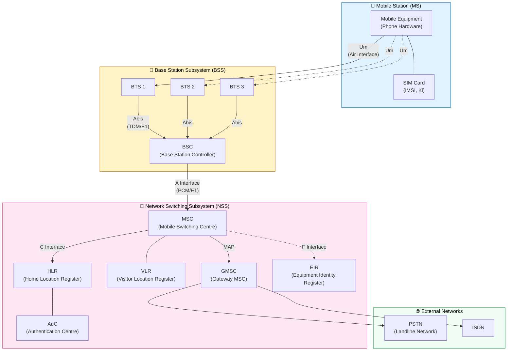
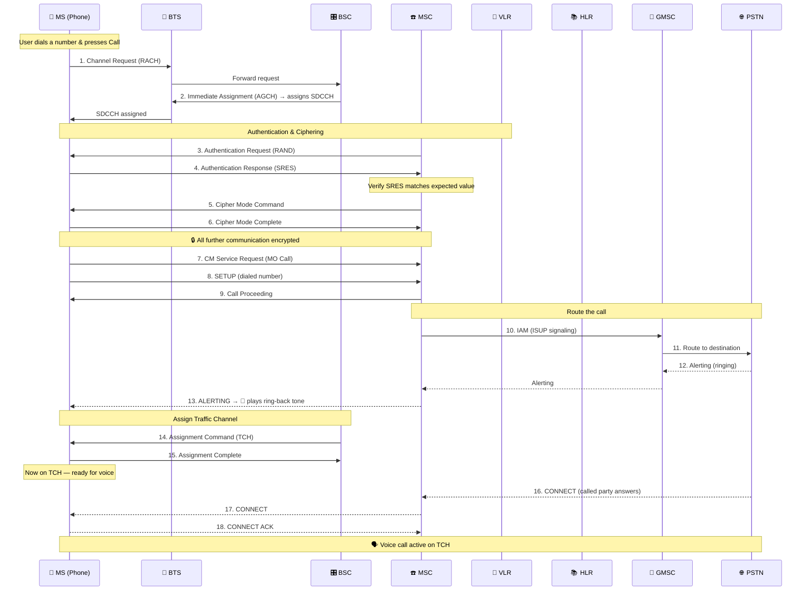

> **Links:** [← Fundamentals](./00-fundamentals.md) | [README](./README.md) | [GPRS & EDGE →](./02-2G-GPRS-EDGE.md)

# 📞 2G GSM — Global System for Mobile Communications

## Overview

GSM was the first **digital** cellular standard, replacing the analog 1G systems. Launched in **1991** in Finland, it became the world's most successful mobile standard with over 5 billion subscribers at its peak.

> **Why was GSM revolutionary?** Before GSM, every country had its own incompatible analog system. GSM created a **single standard** across Europe (and later the world), enabling international roaming for the first time. It also introduced the **SIM card**, separating the subscriber identity from the phone hardware.

### 🎯 GSM at a Glance

| Parameter | Value |
|---|---|
| **Generation** | 2G |
| **Launch Year** | 1991 (Finland) |
| **Multiple Access** | TDMA + FDMA (hybrid) |
| **Carrier Bandwidth** | 200 kHz |
| **Time Slots per Carrier** | 8 |
| **Modulation** | GMSK (Gaussian Minimum Shift Keying) |
| **Frequency Bands** | GSM-900 (890–960 MHz), DCS-1800 (1710–1880 MHz) |
| **Max Data Rate (circuit)** | 9.6 kbps (later 14.4 kbps) |
| **Duplex Method** | FDD |
| **Codec (original)** | Full Rate: 13 kbps, Half Rate: 5.6 kbps |
| **Max Cell Radius** | ~35 km (limited by timing advance) |

### GSM Design Goals

1. **Pan-European compatibility** — one phone works across borders
2. **Digital voice quality** — better than analog, with encryption
3. **SIM-based identity** — swap your SIM, keep your number
4. **Roaming support** — built into the architecture from Day 1
5. **Spectrum efficiency** — digital compression supports more users per MHz
6. **Security** — authentication and encryption (A3/A5/A8 algorithms)

---

## GSM Architecture

🎯 **Interview Favourite:** "Draw and explain the GSM network architecture."

---

## BSS Nodes (Radio Side)

| Node | Full Name | Role | Analogy |
|---|---|---|---|
| **BTS** | Base Transceiver Station | Handles radio transmission/reception; the physical tower and antennas | 📡 The "cell tower" — like a Wi-Fi access point but much more powerful |
| **BSC** | Base Station Controller | Controls multiple BTSs; manages radio resources, handover, power control, frequency assignment | 🎛️ The "regional manager" — coordinates all the towers in its area |

### BSS Interfaces

| Interface | Between | Protocol/Transport | Purpose |
|---|---|---|---|
| **Um** | MS ↔ BTS | Radio (Air interface) | Voice, signaling over the air |
| **Abis** | BTS ↔ BSC | TDM over E1/T1 (16/64 kbps) | Carries traffic + O&M from tower to controller |
| **A** | BSC ↔ MSC | PCM over E1 (64 kbps per voice channel) | Carries voice traffic + signaling to the switch |

---

## NSS Nodes (Core Network)

🎯 **Interview Favourite:** "What is the role of HLR, VLR, MSC?"

| Node | Full Name | Role | Analogy |
|---|---|---|---|
| **MSC** | Mobile Switching Centre | The "brain" — routes calls, manages handovers between BSCs, coordinates with databases | ☎️ Like a telephone exchange that connects callers to each other |
| **GMSC** | Gateway MSC | Entry/exit point to external networks (PSTN, other mobile networks) | 🚪 The "front door" — any call from outside enters through here |
| **HLR** | Home Location Register | Permanent database storing subscriber profiles: phone number (MSISDN), services, current VLR location | 📚 Like your permanent address at the city register office — always knows where you're registered |
| **VLR** | Visitor Location Register | Temporary database at the MSC storing info about subscribers *currently* in its area | 🏨 Like a hotel guest register — tracks who's visiting right now |
| **AuC** | Authentication Centre | Stores secret key (Ki) for each subscriber; generates authentication and encryption parameters | 🔐 The "vault" — holds the master keys to verify your identity |
| **EIR** | Equipment Identity Register | Database of IMEI numbers; maintains white/grey/black lists of devices | 🚔 The "police database" — checks if a phone is stolen (blacklisted) |

> **How HLR and VLR work together:** When you travel to a new city, the local MSC/VLR says "Hey HLR, subscriber X has arrived in my area." The HLR updates its records ("X is now at VLR-Mumbai") and sends the subscriber's profile to the new VLR. When someone calls you, the GMSC asks the HLR "Where is this subscriber?" → HLR says "They're at VLR-Mumbai" → call is routed there.

---

## Air Interface: TDMA Frame Structure

🎯 **GSM combines FDMA and TDMA:**
- **FDMA**: The spectrum is divided into **200 kHz** carriers (e.g., GSM-900 has 124 carriers)
- **TDMA**: Each 200 kHz carrier is divided into **8 time slots**

So each user gets: **one time slot on one carrier** = 1 physical channel.

### Frame Hierarchy

| Level | Duration | Composition | Purpose |
|---|---|---|---|
| **Time Slot (Burst)** | 0.577 ms | ~156.25 bit periods | Carries one burst of data |
| **TDMA Frame** | 4.615 ms | 8 time slots (TS0–TS7) | Basic frame — one slot per user |
| **Multiframe (26)** | 120 ms | 26 TDMA frames | Used for traffic channels (TCH) |
| **Multiframe (51)** | 235.4 ms | 51 TDMA frames | Used for control channels (BCCH, etc.) |
| **Superframe** | 6.12 s | 1326 TDMA frames (= 51 × 26-multiframes) | Synchronization cycle |
| **Hyperframe** | 3 h 28 min 53 s | 2048 superframes | Encryption counter cycle |

> **Why 26-frame multiframe for traffic?** Out of 26 frames: 24 carry traffic (voice), 1 carries SACCH (slow signaling), and 1 is idle. The idle frame is when the phone **scans neighbouring cells** for handover — this is the trick that makes MAHO (Mobile Assisted Handover) work!

---

## GSM Logical Channels

GSM has many logical channels mapped onto physical time slots. Understanding their purpose is critical.

### Broadcast Channels (Downlink only — Base Station → Mobile)

| Channel | Full Name | Purpose | Analogy |
|---|---|---|---|
| **FCCH** | Frequency Correction Channel | Transmits a pure sine wave so the MS can lock onto the exact carrier frequency | 🎵 Like a tuning fork — "this is the frequency, tune to it" |
| **SCH** | Synchronisation Channel | Carries the Base Station Identity Code (BSIC) and frame timing info | ⏱️ "Here's who I am and what time it is" |
| **BCCH** | Broadcast Control Channel | Broadcasts cell parameters: LAI, frequencies of neighbours, cell ID, max power | 📢 The "billboard" — continuously announces cell info to all phones in range |

### Common Control Channels

| Channel | Direction | Purpose | Analogy |
|---|---|---|---|
| **PCH** | DL (BS → MS) | **Paging Channel** — alerts the MS of an incoming call/SMS | 📣 "Hey Subscriber X, you have a phone call!" |
| **RACH** | UL (MS → BS) | **Random Access Channel** — MS sends access requests (slotted ALOHA) | 🙋 "I want to make a call!" (raising hand in class) |
| **AGCH** | DL (BS → MS) | **Access Grant Channel** — assigns a dedicated channel (SDCCH) in response to RACH | ✅ "Granted! Use channel X, slot Y" |

### Dedicated Control Channels

| Channel | Direction | Purpose | Analogy |
|---|---|---|---|
| **SDCCH** | Both | **Standalone Dedicated Control Channel** — carries signaling: authentication, call setup, SMS, location update | 📝 A private "conference room" for paperwork before the actual call starts |
| **SACCH** | Both | **Slow Associated Control Channel** — continuous during a call; carries power control and measurement reports | 📊 Like a "health monitor" running alongside your call — constantly reporting signal quality |
| **FACCH** | Both | **Fast Associated Control Channel** — "steals" TCH frames for urgent signaling (e.g., handover commands) | 🚨 Emergency interruption — "switch to a new cell NOW!" Takes over the voice channel briefly |

### Traffic Channels

| Channel | Direction | Data Rate | Purpose |
|---|---|---|---|
| **TCH/F** | Both | 13 kbps (full rate) | **Full-rate Traffic Channel** — one call per time slot |
| **TCH/H** | Both | 5.6 kbps (half rate) | **Half-rate Traffic Channel** — two calls share one time slot (lower quality) |
| **TCH/F9.6** | Both | 9.6 kbps | Data traffic channel |

> **Channel Mapping:** Typically in a cell, **TS0 of carrier 0 (C0)** is reserved for broadcast/control channels (BCCH, FCCH, SCH, PCH, RACH, AGCH). The remaining slots carry SDCCH and TCH.

---

## SIM Card Innovation

🎯 The SIM (Subscriber Identity Module) was one of GSM's most important innovations.

| Identifier | Full Name | Stored On | Format | Purpose |
|---|---|---|---|---|
| **IMSI** | International Mobile Subscriber Identity | SIM card | Up to 15 digits: MCC(3) + MNC(2–3) + MSIN(9–10) | Uniquely identifies the **subscriber** worldwide |
| **IMEI** | International Mobile Equipment Identity | Phone hardware | 15 digits: TAC(8) + Serial(6) + Check(1) | Uniquely identifies the **device** (can detect stolen phones) |
| **MSISDN** | Mobile Station ISDN Number | HLR | Country code + number (e.g., +91-9876543210) | Your actual **phone number** — what people dial |
| **TMSI** | Temporary Mobile Subscriber Identity | VLR | 4 bytes, locally assigned | Temporary ID used over the air instead of IMSI (for **privacy** — so eavesdroppers can't track you by IMSI) |
| **Ki** | Authentication Key | SIM + AuC | 128-bit secret key | **Never transmitted** — used in challenge-response authentication (A3/A8 algorithms) |

> **Why TMSI?** If your IMSI were broadcast over the air every time you made a call, anyone with a scanner could track you. So after initial authentication, the VLR assigns a TMSI — a temporary alias that changes periodically. The mapping TMSI ↔ IMSI is known only to the VLR.

---

## MAHO — Mobile Assisted Handover

🎯 **Interview Favourite:** "How does GSM handle handover?"

In GSM, the **network** makes the handover decision (not the UE), but the **UE assists** by providing measurements.

### How It Works

1. During an active call, the UE is assigned one time slot per TDMA frame
2. During the **idle frame** (frame 26 in the 26-multiframe), the UE quickly tunes to **neighbouring cell frequencies** and measures their signal strength (RXLEV) and quality (RXQUAL)
3. The UE reports these measurements to the BSC via the **SACCH** channel (every 480 ms, ~2 reports/second)
4. The BSC runs a **handover algorithm** comparing:
   - Signal strength of current cell vs neighbours
   - Signal quality (BER)
   - Distance (timing advance)
   - Interference levels
5. If a neighbour is significantly better → BSC triggers handover

### Four Types of GSM Handover

| Type | What Happens | Controlled By | Complexity |
|---|---|---|---|
| **Intra-BTS** | Move to a different time slot/frequency on the **same BTS** | BSC | Simple — same tower, just change channel |
| **Inter-BTS, Intra-BSC** | Move to a **different BTS** under the **same BSC** | BSC | Moderate — BSC handles everything internally |
| **Inter-BSC, Intra-MSC** | Move to a BTS under a **different BSC**, same MSC | MSC | Complex — MSC must coordinate between two BSCs |
| **Inter-MSC** | Move to a completely **different MSC** area | Both MSCs | Most complex — involves signaling between two MSCs |

> **Handover Margin:** The BSC doesn't trigger handover the instant a neighbour is stronger. It uses a **hysteresis margin** (typically 2–6 dB) to prevent "ping-pong" — rapidly switching back and forth between two cells at the boundary.

---

## GSM Call Setup (Mobile Originated Call)

🎯 Understanding this flow shows how all the network elements work together:

### Call Setup Explained Step by Step

| Step | What Happens | Why |
|---|---|---|
| **Channel Request** | MS sends a burst on RACH (random access — may collide with other MSs!) | MS needs a channel to talk to the network |
| **Immediate Assignment** | BSC assigns an SDCCH (signaling channel) via AGCH | Signaling needs a private channel, not shared RACH |
| **Authentication** | MSC sends RAND → MS computes SRES using Ki (secret key on SIM) and returns it | Network verifies you are who you claim to be |
| **Ciphering** | Both sides start encrypting with a session key (Kc) derived during auth | Protect the call from eavesdropping |
| **Setup → Call Proceeding** | MS tells MSC what number it wants to call; MSC acknowledges | Initiate call routing |
| **Traffic Channel Assignment** | BSC assigns a TCH (voice channel) | SDCCH was just for signaling; voice needs TCH |
| **Alerting** | Remote party's phone is ringing | MS hears ring-back tone |
| **Connect** | Remote party answers → voice path established | Call is now active |

---

## GSM Limitations

| Limitation | Details | Impact |
|---|---|---|
| **Low Data Rate** | Max 9.6 kbps (circuit-switched) | Useless for internet browsing — led to GPRS/EDGE |
| **Circuit-Switched Only** | Dedicated channel held for entire call duration | Wastes resources during silence periods (60% of a voice call is silence!) |
| **Hard Handover** | Break-before-make | Brief interruption during handover (usually imperceptible) |
| **Limited Capacity** | 8 users per 200 kHz carrier | Congestion in dense urban areas |
| **Security Weaknesses** | A5/1 cipher broken; one-way authentication (network doesn't prove itself to UE) | Vulnerable to IMSI catchers, eavesdropping |
| **No Packet Data** | Cannot efficiently handle bursty internet traffic | Addressed by GPRS (2.5G) |

---

## 🧪 Quiz

**Q1: How many users can simultaneously share one GSM carrier (200 kHz)?**

Answer

8 users — one per time slot. Each 200 kHz carrier is divided into 8 TDMA time slots, and each voice call occupies one time slot (for Full Rate). With Half Rate coding, up to 16 users could share one carrier.

**Q2: What is the purpose of the BCCH channel, and why is it always transmitted at constant power?**

Answer

The BCCH (Broadcast Control Channel) broadcasts cell identity, neighbour cell lists, and system parameters to all mobiles in the area. It must be transmitted at constant power because mobile stations use the BCCH signal strength (RXLEV) to measure and compare cells for cell selection and handover decisions. If the power varied, the measurements would be unreliable.

**Q3: What is the difference between IMSI and TMSI, and why is TMSI used?**

Answer

IMSI (International Mobile Subscriber Identity) is the permanent subscriber identifier stored on the SIM card (up to 15 digits: MCC+MNC+MSIN). TMSI (Temporary Mobile Subscriber Identity) is a locally assigned temporary ID given by the VLR. TMSI is used for privacy — if the IMSI were transmitted over the air for every transaction, eavesdroppers could track subscribers. TMSI changes periodically and is only mapped to IMSI at the VLR.

**Q4: During an active GSM call, when does the mobile phone scan neighbouring cells for handover? How is this possible?**

Answer

The mobile scans during the **idle frame** (the 26th frame in the 26-multiframe structure for TCH). In a 26-frame multiframe: 24 frames carry traffic, 1 carries SACCH (signaling), and 1 is idle. During this idle frame (~4.6 ms), the radio quickly retunes to a neighbour cell's BCCH frequency, measures its signal strength, then tunes back. It cycles through the neighbour list (typically 6 cells) over multiple idle frames. This is called **MAHO (Mobile Assisted Handover)**.

**Q5: Explain the difference between SDCCH, SACCH, and FACCH.**

Answer

- **SDCCH (Standalone Dedicated Control Channel):** A dedicated signaling channel used *before* a call — for authentication, call setup, SMS delivery, location updates. It's a "private room for paperwork."
- **SACCH (Slow Associated Control Channel):** Runs continuously *during* a call alongside the TCH. Carries measurement reports (for handover) and power control commands. It's the "health monitor" of the call.
- **FACCH (Fast Associated Control Channel):** Used for *urgent* signaling during a call by "stealing" TCH frames. Primarily used for handover commands when there's no time to wait for the SACCH. It's the "emergency intercom."

**Q6: What role does the VLR play, and how does it interact with the HLR?**

Answer

The VLR is a temporary database at each MSC that stores profile information for subscribers currently roaming in its area. When a subscriber enters a new MSC area, the VLR contacts the HLR to: (1) inform the HLR of the subscriber's new location, and (2) download the subscriber's profile (services, authentication data) from the HLR. The HLR updates its records to point to the new VLR. This way, incoming calls can be routed correctly — the GMSC asks the HLR "where is subscriber X?" and gets pointed to the correct VLR/MSC.

**Q7: Why is the maximum cell radius in GSM limited to approximately 35 km?**

Answer

The limitation comes from the **Timing Advance (TA)** mechanism. In TDMA, each mobile must send its burst so it arrives at the BTS at exactly the right moment within the time slot. Farther mobiles must transmit earlier to compensate for propagation delay. The TA value is 6 bits (0–63), with each step representing ~550 metres of distance. So maximum TA = 63 × 550 m ≈ 35 km. Beyond this, the burst would arrive too late and overlap with the next time slot, causing interference.

**Q8: In the GSM call setup flow, why does the network assign an SDCCH first and then switch to a TCH, instead of directly assigning a TCH?**

Answer

Because the initial signaling (authentication, ciphering setup, call setup messages) requires very low bandwidth and would waste a TCH's capacity. An SDCCH uses much less radio resource (it's shared among multiple users via sub-channels). The TCH is only assigned once the call is actually being connected and voice needs to flow. This is efficient — if authentication fails or the called party is busy, you haven't wasted a valuable TCH. It's like using a reception desk to check in before being shown to your hotel room.

