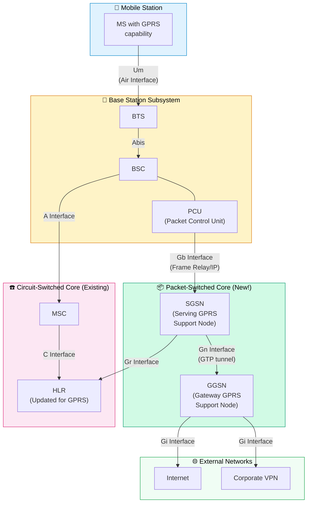
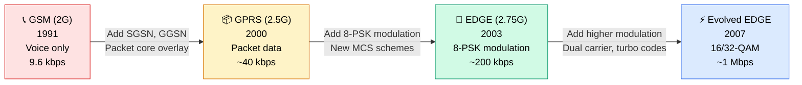

> **Links:** [← 2G GSM](./01-2G-GSM.md) | [README](./README.md) | [3G UMTS →](./03-3G-UMTS.md)

# 📦 GPRS & EDGE — Packet Data Arrives

## GPRS Overview (2.5G)

**GPRS (General Packet Radio Service)** was the first step in bringing **packet-switched data** to mobile networks. Introduced in **2000**, it was essentially a **software upgrade** to existing GSM networks — no new radio hardware needed at the BTS.

> **Why was GPRS needed?** GSM was built for voice. When you made a data call (9.6 kbps circuit-switched), you occupied a full time slot for the entire session — even if you were just staring at a webpage and not actually transferring data. That's like booking an entire taxi for 8 hours just because you might need a ride sometime during the day. GPRS introduced **packet switching**: you only use the channel when you actually have data to send.

### GPRS Key Facts

| Parameter | Value |
|---|---|
| **Generation** | 2.5G |
| **Switching** | Packet-switched (first mobile packet data!) |
| **Theoretical Max** | 171.2 kbps (8 slots × 21.4 kbps) |
| **Realistic Speed** | 30–80 kbps |
| **Always-On** | ✅ Yes — no dial-up needed |
| **Upgrade Type** | Software upgrade to GSM (new core nodes + software on BSC) |
| **Billing Model** | Per data volume (MB), not per minute |
| **IP Support** | ✅ Native IP — phones get an IP address |

---

## Circuit Switching vs. Packet Switching

🎯 **Interview Favourite:** "Explain the difference between circuit and packet switching."

> **Analogy — Phone Line vs. Postal Service:**
> - **Circuit Switching** = Calling someone on a **dedicated phone line**. A physical path is reserved from your phone to the other person's phone for the entire duration of the call. Even during silence, the line is occupied. Nobody else can use it. Predictable quality, but wasteful.
> - **Packet Switching** = Sending **postcards (packets) through the postal service**. Your message is broken into postcards, each with a destination address. Each postcard may take a different route. They may arrive out of order (the receiver reassembles them). The postal system serves many senders simultaneously — no dedicated path is reserved. Efficient, but delivery time may vary.

| Feature | Circuit Switching (GSM Voice) | Packet Switching (GPRS Data) |
|---|---|---|
| **Connection** | Dedicated channel for entire session | Shared channel; resources used only when sending |
| **Resource Usage** | 🔴 Wasteful during silence | 🟢 Efficient — statistical multiplexing |
| **Billing** | Per minute (time-based) | Per MB (volume-based) |
| **Delay** | 🟢 Constant, predictable | 🟡 Variable (queuing delays possible) |
| **Setup Time** | Long (seconds to establish circuit) | 🟢 Fast (always-on after PDP context) |
| **Best For** | Voice calls (constant bitrate) | Internet browsing, email (bursty traffic) |
| **Example** | "I need a dedicated highway lane for my trip" | "I'll share the highway with everyone else" |

---

## GPRS Architecture

🎯 GPRS overlays on the existing GSM architecture. The radio part (BTS) stays the same — the major additions are in the **core network**.



### New GPRS Nodes

| Node | Full Name | Role | Analogy |
|---|---|---|---|
| **PCU** | Packet Control Unit | Added to (or co-located with) the BSC; manages packet scheduling on the air interface — decides which MS gets radio resources for data | 🚦 The "traffic light controller" for data packets on the radio |
| **SGSN** | Serving GPRS Support Node | The packet equivalent of the MSC; handles authentication, mobility management, session management for data users in its area | 📬 Like a **local post office** — knows which subscribers are in its area, handles routing of packets to/from them |
| **GGSN** | Gateway GPRS Support Node | The packet equivalent of the GMSC; interface to external data networks (Internet). Assigns IP addresses. Acts as a firewall/NAT. | 🌐 The **internet gateway** — like a router connecting your home network to the ISP |

### GPRS Interfaces

| Interface | Between | Protocol | Purpose |
|---|---|---|---|
| **Gb** | PCU/BSC ↔ SGSN | Frame Relay or IP | Packet data transport from radio to core |
| **Gn** | SGSN ↔ GGSN | GTP (GPRS Tunneling Protocol) | Data tunneling within the core |
| **Gi** | GGSN ↔ External PDN | IP | Connection to Internet/corporate networks |
| **Gr** | SGSN ↔ HLR | MAP (Mobile Application Part) | Subscriber data, authentication |
| **Gs** | SGSN ↔ MSC/VLR | BSSAP+ | Coordination between PS and CS domains (e.g., combined attach) |
| **Gp** | SGSN ↔ SGSN (inter-PLMN) | GTP | Roaming data tunnels between operators |

---

## GPRS Mobile States

🎯 GPRS introduces three mobility states (different from GSM's idle/active):

```mermaid
stateDiagram-v2
    [*] --> IDLE: Power On (no GPRS attach)
    IDLE --> READY: GPRS Attach + PDP Context Activation
    READY --> STANDBY: Timer expires (no data sent)
    STANDBY --> READY: Data transfer resumes (uplink packet)
    READY --> IDLE: GPRS Detach
    STANDBY --> IDLE: GPRS Detach

    state IDLE {
        direction LR
        note right of IDLE: No GPRS connection\nMS not reachable for data\nNo resources allocated
    }

    state STANDBY {
        direction LR
        note right of STANDBY: PDP context active\nMS reachable via paging\nLocation tracked at Routing Area level
    }

    state READY {
        direction LR
        note right of READY: Actively sending/receiving data\nLocation tracked at cell level\nRadio resources assigned
    }
```

| State | Location Tracking | Data Transfer | Power Consumption | When |
|---|---|---|---|---|
| **IDLE** | Not tracked (not attached) | ❌ Not possible | 🟢 Lowest | Phone on but GPRS not activated |
| **STANDBY** | Routing Area level | ❌ Not active (but PDP context open) | 🟡 Low | No data for a while; can be paged quickly |
| **READY** | Cell level | ✅ Active | 🔴 Highest | Actively browsing, downloading |

> **Why three states instead of just two?** The STANDBY state is the clever middle ground. Your IP address stays assigned (PDP context alive), so you're "always-on" and can receive data quickly (via paging), but you're not wasting battery or radio resources tracking every cell change. You only move to READY when actual data flows.

---

## PDP Context

🎯 **Interview Favourite:** "What is a PDP context?"

**PDP Context (Packet Data Protocol Context)** is the session/tunnel established between the MS and the GGSN that gives the mobile device connectivity to an external data network.

> **Analogy — Opening a Pipe:**  
> Think of it like connecting a garden hose (pipe) from your tap (MS) through the water main (SGSN) to the public water network (GGSN → Internet). The "PDP context activation" is the process of connecting this pipe. Once the pipe is connected:
> - You have a water address (IP address)
> - Water (data) can flow in both directions
> - You're connected to the public network
> - The pipe stays connected even when no water is flowing (STANDBY state)
> - You must explicitly disconnect (deactivate) the pipe when done

### What a PDP Context Contains

| Parameter | Description |
|---|---|
| **PDP Type** | IPv4, IPv6, or PPP |
| **PDP Address** | IP address assigned to the mobile (can be static or dynamic) |
| **APN** | Access Point Name — identifies which external network to connect to (e.g., "internet", "mms", "corporate.vpn") |
| **QoS Profile** | Quality of Service parameters (throughput, delay, reliability) |
| **GTP Tunnel ID** | Unique tunnel identifier between SGSN and GGSN |

> **APN Explained:** When your phone says "APN: internet" in settings, it's telling the GGSN "connect me to the general internet." If it said "APN: corporate.vpn.acme.com", it would connect to Acme Corp's private network instead. The GGSN uses the APN to route you to the right external network.

---

## GPRS Protocol Stack

| Layer | User Plane (Data) | Control Plane (Signaling) |
|---|---|---|
| **Application** | HTTP, FTP, etc. | — |
| **Transport** | TCP / UDP | — |
| **Network** | IP | GMM/SM (GPRS Mobility Mgmt / Session Mgmt) |
| **Data Link** | SNDCP → LLC → RLC/MAC | LLC → RLC/MAC |
| **Physical** | GSM Physical Layer (GMSK, TDMA) | GSM Physical Layer |

### Key Protocols Explained

| Protocol | Full Name | Role |
|---|---|---|
| **SNDCP** | SubNetwork Dependent Convergence Protocol | Compression and segmentation of IP packets |
| **LLC** | Logical Link Control | Reliable link between MS and SGSN (survives cell changes!) |
| **RLC/MAC** | Radio Link Control / Medium Access Control | Manages radio block transmission and retransmission |
| **GTP** | GPRS Tunneling Protocol | Tunnels user data between SGSN and GGSN |
| **GMM** | GPRS Mobility Management | GPRS attach/detach, authentication, routing area updates |
| **SM** | Session Management | PDP context activation/deactivation |

---

## EDGE Overview (2.75G)

**EDGE (Enhanced Data rates for GSM Evolution)** was the final major upgrade to the 2G family. Introduced around **2003**, it boosted data rates by using a higher-order modulation scheme while keeping the same 200 kHz channel and TDMA structure.

> **The key innovation:** GSM/GPRS used GMSK modulation (1 bit/symbol). EDGE introduced **8-PSK (8 Phase Shift Keying)** which transmits **3 bits/symbol** — tripling the raw data rate per time slot.

### EDGE Key Facts

| Parameter | Value |
|---|---|
| **Generation** | 2.75G |
| **Modulation** | GMSK (from GPRS) + **8-PSK (new!)** |
| **Theoretical Max** | 473.6 kbps (8 slots, MCS-9) |
| **Realistic Speed** | 100–200 kbps |
| **Upgrade Type** | Software + new transceiver at BTS (for 8-PSK) |
| **Backward Compatible** | ✅ Fully compatible with GPRS |
| **New Radio Protocol** | EGPRS (Enhanced GPRS) |

---

## 8-PSK vs. GMSK

🎯 Understanding this comparison is key to understanding the GPRS → EDGE jump.

| Feature | GMSK (GPRS) | 8-PSK (EDGE) |
|---|---|---|
| **Bits per Symbol** | 1 | 3 |
| **Throughput per Slot** | ~21.4 kbps (CS-4) | ~59.2 kbps (MCS-9) |
| **Constellation Points** | 2 (like BPSK with Gaussian filtering) | 8 |
| **Envelope** | Constant (no amplitude variation) | Non-constant (amplitude varies) |
| **Amplifier Requirement** | Simple (non-linear OK) | Linear amplifier needed (more expensive) |
| **Robustness** | 🟢 More robust | 🟡 More sensitive to noise/interference |
| **Range** | 🟢 Better (works at cell edge) | 🟡 Shorter effective range |

> **Intuition:** Think of GMSK as using only two symbols (like Morse code — dot and dash). Very clear, works in noisy environments, but slow. 8-PSK uses eight symbols (like using 8 different drum beats). Three times as much info per beat, but you need quiet conditions to distinguish all eight beats.

> **Important:** EDGE doesn't always use 8-PSK. It uses **link adaptation** — switching between GMSK and 8-PSK depending on channel conditions. Near the tower? 8-PSK for speed. At the cell edge? Fall back to GMSK for reliability.

---

## MCS Table (Modulation and Coding Schemes)

🎯 **Interview Favourite:** "Describe the EDGE MCS schemes."

EDGE defines 9 **Modulation and Coding Schemes (MCS-1 to MCS-9)**, replacing the 4 GPRS coding schemes (CS-1 to CS-4).

| MCS | Modulation | Code Rate | Data Rate per Slot (kbps) | Header (bits) | Data (bits) | Family |
|---|---|---|---|---|---|---|
| **MCS-1** | GMSK | ~0.53 | 8.8 | 40 | 176 | C |
| **MCS-2** | GMSK | ~0.66 | 11.2 | 40 | 224 | B |
| **MCS-3** | GMSK | ~0.80 | 14.8 | 40 | 296 | A |
| **MCS-4** | GMSK | ~0.97 | 17.6 | 40 | 352 | C |
| **MCS-5** | 8-PSK | ~0.37 | 22.4 | 40 | 448 | B |
| **MCS-6** | 8-PSK | ~0.49 | 29.6 | 40 | 592 | A |
| **MCS-7** | 8-PSK | ~0.76 | 44.8 | 40 | 896 | B |
| **MCS-8** | 8-PSK | ~0.92 | 54.4 | 40 | 1088 | A |
| **MCS-9** | 8-PSK | ~1.0 | 59.2 | 40 | 1184 | A |

### Reading the Table

- **Lower MCS (1–4):** Use GMSK with increasing code rates → more data, less error protection
- **Higher MCS (5–9):** Use 8-PSK with increasing code rates → maximum throughput but minimum protection
- **Code Rate:** The ratio of actual data bits to total transmitted bits. A code rate of 0.53 means 53% data + 47% redundancy (error correction). A code rate of 1.0 means almost no error correction — maximum speed, minimum protection.

> **Trade-off:** MCS-9 gives you 59.2 kbps per slot — nearly 3× GPRS — but only works with a clean, strong signal. MCS-1 is slower but survives poor conditions. The network continuously adapts the MCS based on real-time channel quality.

### MCS Families (A, B, C)

The "family" concept enables **incremental redundancy (IR)** — a clever retransmission strategy:

| Family | MCS Members | Key Feature |
|---|---|---|
| **A** | MCS-3, 6, 8, 9 | Largest payload sizes |
| **B** | MCS-2, 5, 7 | Medium payload sizes |
| **C** | MCS-1, 4 | Smallest payload sizes |

> **How families help:** If a block sent with MCS-9 (Family A) fails, the retransmission can be sent with MCS-6 or MCS-3 (also Family A) with more error protection, and the receiver **combines** the original and retransmission to decode successfully. This is called **Incremental Redundancy** — it avoids starting from scratch and reuses the information from the failed attempt. Members of the same family have compatible data block sizes, making this combination possible.

---

## GPRS Multislot Classes

In GPRS/EDGE, a device can use **multiple time slots** simultaneously to increase throughput. The **multislot class** defines how many slots a device can use:

| Multislot Class | Downlink Slots | Uplink Slots | Max Active Slots | Example Speed (EDGE, MCS-9) |
|---|---|---|---|---|
| 2 | 2 | 1 | 3 | 118 kbps DL / 59 kbps UL |
| 4 | 3 | 1 | 4 | 178 kbps DL / 59 kbps UL |
| 8 | 4 | 1 | 5 | 237 kbps DL / 59 kbps UL |
| 10 | 4 | 2 | 5 | 237 kbps DL / 118 kbps UL |
| 12 | 4 | 4 | 5 | 237 kbps DL / 237 kbps UL |
| 32 | 5 | 3 | 6 | 296 kbps DL / 178 kbps UL |

> **Why not just use all 8 slots?** The device needs some slots to do other things: monitoring neighbour cells for handover, switching between transmit and receive modes (there's a physical switching time), and the radio hardware has power and processing limitations.

---

## Evolved EDGE (EDGE Evolution)

Released in 3GPP **Release 7** (2007), Evolved EDGE further pushed 2G capabilities:

| Feature | Standard EDGE | Evolved EDGE |
|---|---|---|
| **Modulation** | GMSK, 8-PSK | + 16-QAM, 32-QAM |
| **Peak DL Rate** | 473.6 kbps | Up to ~1 Mbps |
| **Latency** | ~300 ms RTT | ~100 ms RTT |
| **Turbo Codes** | ❌ | ✅ (better error correction) |
| **Dual Carrier** | ❌ | ✅ (two 200 kHz carriers simultaneously) |
| **Deployment** | Widespread | Very limited (operators jumped to 3G/4G instead) |

> **Why didn't Evolved EDGE take off?** By 2007, 3G UMTS/HSPA was already widely deployed and offered much better data rates. Most operators chose to invest in 3G expansion rather than squeezing more out of 2G. Evolved EDGE was mainly used in developing markets where 2G infrastructure was dominant.

---

## 2G Evolution Summary



### Complete 2G Family Comparison

| Feature | GSM | GPRS | EDGE | Evolved EDGE |
|---|---|---|---|---|
| **Generation** | 2G | 2.5G | 2.75G | 2.75G+ |
| **Year** | 1991 | 2000 | 2003 | 2007 |
| **Switching** | Circuit | Packet | Packet | Packet |
| **Modulation** | GMSK | GMSK | GMSK + 8-PSK | + 16/32-QAM |
| **Max Data Rate** | 9.6 kbps | 171.2 kbps | 473.6 kbps | ~1 Mbps |
| **Realistic Speed** | 9.6 kbps | 30–80 kbps | 100–200 kbps | 300–500 kbps |
| **New Core Nodes** | MSC, HLR... | SGSN, GGSN | — | — |
| **New Radio HW** | Baseline | No (SW only) | New TRX for 8-PSK | New TRX |
| **Billing** | Per minute | Per MB | Per MB | Per MB |
| **Always-On** | ❌ | ✅ | ✅ | ✅ |
| **IP Support** | ❌ | ✅ | ✅ | ✅ |

> **Key Takeaway for Interviews:** The beauty of the 2G evolution is how each step built on the previous one with **minimal hardware changes**. GPRS was primarily a software + core network upgrade. EDGE required a new transceiver module at the BTS but no structural changes. This incremental approach protected operators' existing investments.

---

## 🧪 Quiz

**Q1: What is the fundamental difference between GSM (circuit-switched) and GPRS (packet-switched) in terms of resource usage?**
<details><summary>Answer</summary>
In GSM circuit switching, a dedicated time slot is reserved for the entire duration of the call/session, even during periods of silence or inactivity — resources are wasted. In GPRS packet switching, time slots are shared among multiple users using statistical multiplexing — a slot is used only when there's actual data to send, and released immediately after. This makes GPRS much more efficient for bursty data traffic like web browsing.
</details>

**Q2: What are the two new core network nodes introduced by GPRS, and what does each do?**
<details><summary>Answer</summary>

- **SGSN (Serving GPRS Support Node):** Handles mobility management (tracking where the MS is), authentication, and routing of data packets to/from mobile devices in its service area. It's the packet-domain equivalent of the MSC.
- **GGSN (Gateway GPRS Support Node):** The gateway to external packet data networks (Internet, corporate VPNs). It assigns IP addresses, acts as a firewall/NAT, and terminates GTP tunnels from the SGSN. It's the packet-domain equivalent of the GMSC.
</details>

**Q3: What is a PDP Context, and why is it necessary?**
<details><summary>Answer</summary>
A PDP (Packet Data Protocol) Context is a data session established between the MS and the GGSN that defines the connection to an external data network. It contains: the PDP type (IPv4/IPv6), the assigned IP address, the APN (which network to connect to), QoS parameters, and GTP tunnel IDs. It's necessary because without a PDP context, the mobile has no IP address and no defined path to the internet. Think of it as "opening a pipe" from your phone to the internet — data can only flow once the pipe is established.
</details>

**Q4: Why does EDGE achieve higher data rates than GPRS without changing the channel bandwidth?**
<details><summary>Answer</summary>
EDGE introduces **8-PSK modulation** which encodes 3 bits per symbol, compared to GMSK's 1 bit per symbol. Since the symbol rate stays the same (the 200 kHz channel and time slot structure are unchanged), the raw bit rate per time slot approximately triples. Combined with 9 new Modulation and Coding Schemes (MCS-1 through MCS-9) that optimize the trade-off between speed and error protection, EDGE achieves up to 59.2 kbps per slot vs. GPRS's 21.4 kbps per slot.
</details>

**Q5: Explain the three GPRS mobility states (IDLE, STANDBY, READY) and why the STANDBY state exists.**
<details><summary>Answer</summary>

- **IDLE:** Not attached to GPRS at all. No data possible. Lowest power consumption.
- **READY:** Actively transferring data. Location tracked at cell level. Highest power consumption.
- **STANDBY:** PDP context is still active (IP address kept), but no data is currently flowing. Location tracked at Routing Area level (coarser than cell level). The phone can be quickly paged for incoming data.

The STANDBY state exists as a power-saving middle ground. Without it, a phone would either be fully connected (draining battery) or fully disconnected (losing its IP address and requiring full reconnection). STANDBY keeps the session alive with minimal resource usage — enabling the "always-on" experience that GPRS promised.
</details>

**Q6: What is the concept of MCS "families" in EDGE, and how does it enable Incremental Redundancy?**
<details><summary>Answer</summary>
EDGE's 9 MCS schemes are grouped into three families (A, B, C) based on compatible data block sizes:
- Family A: MCS-3, 6, 8, 9
- Family B: MCS-2, 5, 7
- Family C: MCS-1, 4

When a block sent at a high MCS (e.g., MCS-9, Family A) fails, the retransmission can be sent at a lower MCS from the **same family** (e.g., MCS-6, more error protection). The receiver then **combines** the bits from both attempts to successfully decode the data. This is Incremental Redundancy (IR) — it doesn't discard the failed attempt but uses it as additional information. This is more efficient than simple retransmission because it reuses the energy already spent on the first transmission.
</details>

**Q7: What is an APN, and how does the GGSN use it?**
<details><summary>Answer</summary>
APN (Access Point Name) is a string identifier (like "internet", "mms", or "corporate.vpn.acme.com") included in the PDP Context activation request. It tells the GGSN which external network the mobile wants to connect to. The GGSN uses the APN to:
1. Look up the correct external network/gateway to route traffic to
2. Apply the appropriate QoS, charging, and firewall policies
3. Assign an IP address from the correct pool

For example, "internet" APN connects to the public internet, "mms" connects to the operator's MMS server, and a corporate APN connects to a company's private network via a VPN.
</details>

**Q8: Why did Evolved EDGE see limited deployment despite offering speeds up to 1 Mbps?**
<details><summary>Answer</summary>
By the time Evolved EDGE was standardized (3GPP Release 7, 2007), 3G UMTS/HSPA was already widely deployed and offered data rates of 14.4 Mbps (HSDPA) — far exceeding Evolved EDGE's ~1 Mbps. Operators preferred to invest in 3G/4G expansion rather than squeezing incremental improvements out of the aging 2G TDMA air interface. Evolved EDGE found some use in developing markets where 2G infrastructure was dominant and 3G rollout was cost-prohibitive, but it was largely a transitional technology that was overtaken by events.
</details>
