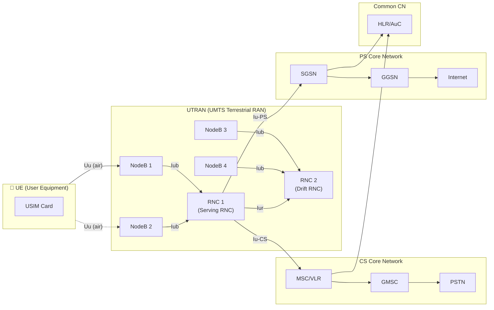
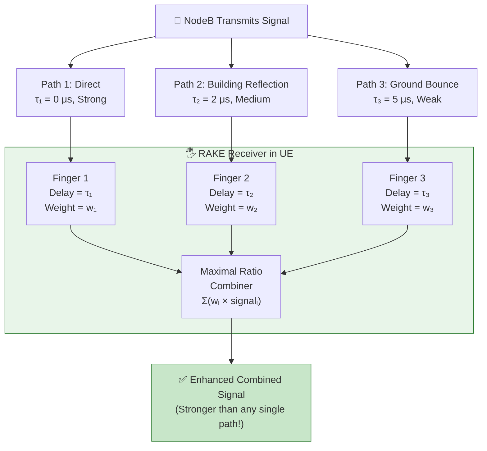

# 📡 3G UMTS / WCDMA

> **Links:** [← GPRS & EDGE](./02-2G-GPRS-EDGE.md) | [README](./README.md) | [3G HSPA →](./04-3G-HSPA.md)

---

## 📋 Overview at a Glance

| Parameter | Value |
|---|---|
| **Full Name** | Universal Mobile Telecommunications System |
| **3GPP Release** | Release 99 (1999) |
| **Air Interface** | WCDMA (Wideband Code Division Multiple Access) |
| **Channel Bandwidth** | 5 MHz (vs. 200 kHz in GSM) |
| **Multiple Access** | CDMA (Code Division Multiple Access) |
| **Duplex Mode** | FDD (paired bands) and TDD (unpaired bands) |
| **Peak Data Rate** | Up to 2 Mbps (theoretical, stationary) |
| **Typical Latency** | ~100–150 ms round trip |
| **Chip Rate** | 3.84 Mcps |
| **Modulation** | QPSK (DL & UL) |
| **Core Network** | Combined CS (voice) + PS (data) domains |

> **Why 3G?** 2G/GPRS was designed around voice with data bolted on. 3G was designed from the ground up for both voice and mobile data, enabling video calls, mobile web browsing, and app stores that would reshape the industry.

---

## 🏗️ UTRAN Architecture

🎯 **The biggest architectural change from 2G:** The Radio Access Network was completely redesigned. NodeB replaced BTS, and the Radio Network Controller (RNC) replaced the BSC — but with significantly more intelligence and new interfaces.



### RAN Nodes: GSM vs. UMTS

| Feature | GSM (2G) | UMTS (3G) |
|---|---|---|
| **Base Station** | BTS (Base Transceiver Station) | NodeB |
| **Controller** | BSC (Base Station Controller) | RNC (Radio Network Controller) |
| **BS Intelligence** | Very low — just transmit/receive | More intelligent — some radio processing |
| **Controller Intelligence** | Moderate | Very high — handover, power control, radio resource mgmt |
| **BS↔Controller Interface** | Abis | Iub |
| **Controller↔CS Core** | A interface → MSC | Iu-CS → MSC |
| **Controller↔PS Core** | Gb interface → SGSN | Iu-PS → SGSN |
| **Controller↔Controller** | ❌ No equivalent | Iur (enables soft handover between RNCs) |

### 🎯 Key Interfaces

| Interface | Connects | Purpose |
|---|---|---|
| **Uu** | UE ↔ NodeB | Air interface (WCDMA) |
| **Iub** | NodeB ↔ RNC | Carries user data and control signalling |
| **Iu-CS** | RNC ↔ MSC | Circuit-switched traffic (voice, video calls) |
| **Iu-PS** | RNC ↔ SGSN | Packet-switched traffic (data) |
| **Iur** | RNC ↔ RNC | Inter-RNC soft handover support (unique to UMTS!) |

> **💡 The Iur interface is special:** GSM had no equivalent. It exists specifically because CDMA soft handover requires a UE to simultaneously connect to NodeBs under *different* RNCs. The Iur interface makes this possible by allowing RNCs to coordinate.

---

## 📖 CDMA Explained from Scratch

### The Cocktail Party Analogy

🎯 **Imagine you're at a massive party** where everyone is talking at the same time, in the same room, at the same volume. Sounds like chaos, right? But here's the trick — **everyone is speaking a different language**. You speak Hindi, your friend speaks French, another speaks Japanese.

Even though all the sound waves overlap in the air, **you can pick out the Hindi conversation** because your brain knows the "code" (the language). Everyone else's conversations sound like background noise to you.

**That's exactly how CDMA works:**
- The "room" = the 5 MHz frequency band (everyone shares it)
- The "people talking" = different mobile phones transmitting simultaneously
- The "different languages" = **unique spreading codes** assigned to each user
- Your "brain knowing the language" = the receiver correlating with the correct code

### How Spreading Works

In WCDMA, each user's data bit is multiplied by a unique, much faster code sequence called a **spreading code** (or chip sequence).

| Concept | Definition | Analogy |
|---|---|---|
| **Chip** | The smallest element of the spreading code (like a single letter in a language) | One syllable of speech |
| **Chip Rate** | 3.84 Mcps (million chips per second) — fixed in WCDMA | How fast the "language" is spoken |
| **Spreading Factor (SF)** | Ratio of chip rate to data rate. SF = Chip Rate / Data Rate | How "wordy" the language is |
| **Processing Gain** | 10 × log₁₀(SF) in dB — the advantage gained by spreading | How much "background noise" you can filter out |

**Example:** If a voice call has a data rate of 12.2 kbps:
- SF = 3,840,000 / 12,200 = **~315** → meaning each data bit is spread into 315 chips
- Processing Gain = 10 × log₁₀(315) = **~25 dB** — that's a huge noise-filtering advantage!

**Higher SF = lower data rate but stronger signal** (more spreading = more noise immunity).
**Lower SF = higher data rate but weaker signal** (less spreading = more susceptible to noise).

This is a fundamental trade-off: voice calls use high SF (~256), while data uses low SF (~4–16).

---

## ⚔️ CDMA vs. TDMA Comparison

🎯 This comparison helps you understand *why* 3G moved from TDMA to CDMA.

| Feature | TDMA (GSM/2G) | CDMA (UMTS/3G) |
|---|---|---|
| **How users share** | Each user gets a time slot | All users transmit simultaneously with unique codes |
| **Frequency reuse** | Careful planning needed (reuse factor 1/3, 1/4) | **Universal frequency reuse (factor 1)** — every cell uses same frequency |
| **Bandwidth per user** | 200 kHz carrier / 8 slots = 25 kHz | 5 MHz shared among all users |
| **Capacity limited by** | Number of time slots | Interference from other users |
| **Multipath** | Problem (ISI) — needs equalizer | Advantage — RAKE receiver combines multipaths |
| **Soft capacity** | No — fixed number of slots | Yes — can add more users with graceful degradation |
| **Handover** | Hard handover (break-before-make) | Soft handover (make-before-break) |
| **Power control** | Important but not critical | **Absolutely critical** (near-far problem) |
| **Frequency planning** | Complex — must plan reuse patterns | Simple — all cells use same frequency |

> **🎯 Key insight for interviews:** CDMA's universal frequency reuse (factor = 1) is its biggest advantage for network planning. In GSM, you spend enormous effort planning which frequencies go where. In UMTS, every cell uses the same 5 MHz — enormously simpler. But this makes **interference management** (power control) absolutely critical.

---

## 🖐️ RAKE Receiver: Turning a Problem into an Advantage

### The Multipath Problem

When a radio signal travels from NodeB to your phone, it doesn't take just one path. It bounces off buildings, trees, the ground, cars — creating **multiple copies** of the same signal that arrive at different times and strengths.

In GSM (TDMA), these delayed copies cause **Inter-Symbol Interference (ISI)** — symbols blur into each other. GSM needs an equalizer to fight this.

### How RAKE Solves It

🎯 **The RAKE receiver is like having multiple hands (fingers) reaching out to catch the same ball thrown from different directions.** Instead of one catcher overwhelmed by confusing echoes, you have **multiple "fingers,"** each tuned to a different delay path. Each finger:

1. **Locks onto one multipath component** using a delay-matched correlator
2. **De-spreads it** using the known spreading code
3. **Estimates its strength and timing**

Then all the fingers' outputs are **combined** (usually using Maximal Ratio Combining — weighting each path by its signal strength), producing a **stronger, cleaner signal** than any single path alone.



> **🎯 The key insight:** In GSM, multipath is a **problem** you fight against. In CDMA, multipath becomes a **diversity gain** — the RAKE receiver actually produces a *better* signal by combining multiple paths. This is one of CDMA's fundamental advantages, and it's called **multipath diversity**.

---

## ⚡ Power Control: Solving the Near-Far Problem

### The Near-Far Problem Explained

🎯 **Imagine you're in a quiet library trying to listen to someone whispering from across the room.** Now someone sits right next to you and starts talking at full volume. You can't hear the whisper anymore — the nearby person's voice **drowns it out**.

In CDMA, **all users share the same frequency simultaneously.** If a UE close to the NodeB transmits at the same power as a UE far from the NodeB, the close UE's signal will be enormously stronger at the receiver. It will **overwhelm** the far UE's signal, effectively blocking it.

**The solution:** Tell the nearby UE to lower its power and the far UE to raise its power, so they all arrive at the NodeB at roughly **equal strength**. This must be done continuously and rapidly because users move.

### 🎯 Three Types of Power Control

| Type | Direction | Speed | How It Works |
|---|---|---|---|
| **Open Loop** | UL only | Slow (initial) | UE measures received DL signal strength and sets its initial transmit power inversely. Strong DL → "I must be close" → transmit low. Weak DL → "I must be far" → transmit high. Crude but fast initial estimate. |
| **Inner Loop (Fast Closed Loop)** | UL & DL | **1,500 times/sec** (every 0.667 ms!) | NodeB measures received SIR, compares to target SIR. Sends TPC (Transmit Power Control) commands: "UP" or "DOWN" by 1 dB steps. This is the most critical power control mechanism. |
| **Outer Loop** | UL & DL | Slow (10–100 Hz) | RNC adjusts the **target SIR** used by inner loop. Monitors actual BLER (Block Error Rate). If BLER too high → raise target SIR. If BLER too low → lower target SIR (save power, reduce interference). |

> **Why 1,500 Hz?** Because in a mobile environment, the channel changes rapidly (Rayleigh fading). The power control must react faster than the channel changes. At 3.84 Mcps with slot duration of 0.667 ms, that's 1,500 power updates per second — fast enough to track fading.

> **🎯 Interview point:** If power control fails, the entire CDMA system collapses. Unlike TDMA where one user's problem stays in their time slot, in CDMA one overpowered user raises the interference floor for ALL users. This is called the **breathing effect** — as load increases, cell coverage actually shrinks because interference rises.

---

## 📊 UMTS Channel Structure

UMTS has a three-layer channel architecture: Logical → Transport → Physical.

### Physical Channels (Layer 1)

| Channel | Full Name | Direction | Purpose |
|---|---|---|---|
| **CPICH** | Common Pilot Channel | DL | Cell identification, channel estimation, handover measurements. Always transmitted at constant power. 🎯 |
| **P-SCH** | Primary Synchronization Channel | DL | Slot synchronization (same code for all cells) |
| **S-SCH** | Secondary Synchronization Channel | DL | Frame synchronization + scrambling code group ID |
| **P-CCPCH** | Primary Common Control Physical Channel | DL | Carries BCH (system information broadcast) |
| **S-CCPCH** | Secondary Common Control Physical Channel | DL | Carries PCH and FACH |
| **DPCH** | Dedicated Physical Channel | DL & UL | User data + control for a specific connection |
| **AICH** | Acquisition Indication Channel | DL | Response to PRACH access attempts |
| **PRACH** | Physical Random Access Channel | UL | Initial access / random access from UE |
| **DPCCH** | Dedicated Physical Control Channel | UL | TPC commands, pilot, TFCI |
| **DPDCH** | Dedicated Physical Data Channel | UL | User data on uplink |

### Transport Channels

| Channel | Full Name | Direction | What It Carries |
|---|---|---|---|
| **BCH** | Broadcast Channel | DL | System Information (cell parameters, PLMN ID, access barring) |
| **PCH** | Paging Channel | DL | Paging messages for idle mode UEs |
| **FACH** | Forward Access Channel | DL | Small data, signalling, responses to RACH |
| **RACH** | Random Access Channel | UL | Initial access, small UL data |
| **DCH** | Dedicated Channel | DL & UL | Dedicated user data and control (main workhorse) |
| **DSCH** | Downlink Shared Channel | DL | Shared data channel (precursor to HSDPA's HS-DSCH) |

### Channel Mapping Flow

```
Logical Channels → Transport Channels → Physical Channels
DTCH (traffic)   → DCH              → DPCH
CCCH (control)   → RACH (UL)        → PRACH
                  → FACH (DL)        → S-CCPCH
BCCH (broadcast)  → BCH              → P-CCPCH
PCCH (paging)     → PCH              → S-CCPCH
```

---

## 🔄 FDD vs. TDD in UMTS

| Feature | FDD (W-CDMA) | TDD (TD-CDMA / TD-SCDMA) |
|---|---|---|
| **Spectrum** | Paired bands (UL & DL separate) | Unpaired single band |
| **UL/DL Separation** | Frequency (different bands) | Time (different time slots) |
| **Chip Rate** | 3.84 Mcps | 3.84 Mcps (TD-CDMA) or 1.28 Mcps (TD-SCDMA) |
| **Guard** | Guard band between UL/DL | Guard period between UL/DL slots |
| **Symmetry** | Fixed UL/DL ratio | Flexible UL/DL ratio (good for asymmetric traffic!) |
| **Deployment** | Dominant worldwide | China (TD-SCDMA), some hotspots |
| **Cell Size** | Large cells possible | Smaller cells preferred (timing issues) |
| **Handover** | Soft handover supported | Hard handover typically |

---

## 🤝 Handover Types in UMTS

### 🎯 Soft Handover: Unique to CDMA

**Why soft handover exists:** In GSM (TDMA), each cell uses a different frequency. Handover means tuning to a new frequency — you **must** drop the old connection before making the new one (hard handover = "break before make").

In CDMA, **all cells use the same frequency!** There's nothing stopping a UE from simultaneously receiving signals from multiple NodeBs on the same frequency. So the UE maintains connections with 2–3 cells at once during handover — **make before break**.

**The Active Set** is the list of cells the UE is simultaneously connected to (typically 1–3 cells). The RNC manages adding/removing cells from the Active Set.

### Handover Types Comparison

| Type | Description | When Used | Mechanism |
|---|---|---|---|
| **Hard Handover** | Break-before-make: old link dropped, new link established | Inter-frequency handover, Inter-RAT (UMTS↔GSM) | UE tunes to new frequency, re-syncs |
| **Soft Handover** | Make-before-break: UE connected to 2+ NodeBs under different RNCs simultaneously | Same-frequency, different cells (different RNCs) | Active Set managed by Serving RNC via Iur |
| **Softer Handover** | UE connected to 2+ sectors of the **same** NodeB | Same-frequency, different sectors of one site | Combined at NodeB level (no Iur needed, RAKE-like combining) |
| **Inter-RAT** | Handover between UMTS and GSM/GPRS | UMTS coverage edge, voice fallback | Compressed mode for measurements |

### 🎯 Compressed Mode (for Inter-RAT Handover)

**The problem:** A UMTS UE uses a single receiver. To measure GSM frequencies, it needs to temporarily stop its UMTS reception. But CDMA transmits continuously — there are no idle frames like in GSM.

**The solution — Compressed Mode:** The NodeB "compresses" data into a shorter time window, creating **transmission gaps**. During these gaps, the UE quickly tunes to GSM frequencies, measures signal quality, and tunes back.

Two compression methods:
- **Puncturing:** Some bits are removed (relying on error correction to recover them)
- **Spreading Factor Reduction:** Temporarily halve the SF (double the data rate) to squeeze data into half the time

---

## 📊 UMTS vs. GSM Summary

| Feature | GSM (2G) | UMTS (3G) |
|---|---|---|
| **Access Method** | TDMA/FDMA | WCDMA |
| **Bandwidth** | 200 kHz | 5 MHz |
| **Peak Data Rate** | 9.6 kbps (CSD), 384 kbps (EDGE) | 2 Mbps (theoretical) |
| **Frequency Reuse** | 1/3, 1/4, 1/7 (planning needed) | 1 (universal reuse) |
| **Base Station** | BTS | NodeB |
| **Controller** | BSC | RNC |
| **Core Network** | MSC + SGSN/GGSN | MSC + SGSN/GGSN (evolved) |
| **Handover** | Hard only | Hard + Soft + Softer |
| **SIM Card** | SIM | USIM (in UICC) |
| **Power Control** | Slow (2 Hz) | Fast (1,500 Hz) |
| **Multipath Handling** | Equalizer (fights multipath) | RAKE receiver (exploits multipath) |
| **Capacity** | Fixed (time slots) | Soft (interference-limited) |

---

## 🧪 Quiz

**1. What is the chip rate used in WCDMA, and why does it matter?**
<details>
<summary>Show Answer</summary>

The chip rate is **3.84 Mcps** (million chips per second). It matters because:
- It determines the bandwidth needed (chip rate ≈ bandwidth → 3.84 Mcps needs ~5 MHz)
- Combined with the data rate, it determines the **Spreading Factor** (SF = Chip Rate / Data Rate)
- Higher chip rate = better time resolution for RAKE receiver to distinguish multipath components
</details>

**2. Explain the near-far problem and how UMTS solves it.**
<details>
<summary>Show Answer</summary>

The **near-far problem** occurs because all CDMA users share the same frequency. A UE close to the NodeB would have its signal arrive much stronger than a distant UE's signal, drowning it out. UMTS solves this with **three-layer power control:**
- **Open loop:** Initial power estimate based on DL signal strength
- **Inner loop (fast closed loop):** 1,500 TPC commands/sec adjusting power in 1 dB steps
- **Outer loop:** RNC adjusts target SIR based on actual BLER performance
</details>

**3. 🎯 Why can CDMA perform soft handover but TDMA cannot?**
<details>
<summary>Show Answer</summary>

In CDMA, **all cells use the same frequency** (frequency reuse factor = 1). This means a UE can receive and decode signals from multiple NodeBs simultaneously — they're all on the same frequency, distinguished only by codes. In TDMA (GSM), different cells use **different frequencies**, so the UE would need multiple receivers to listen to multiple frequencies simultaneously, which wasn't practical. Therefore GSM uses hard handover (break-before-make) while CDMA enables soft handover (make-before-break).
</details>

**4. How does the RAKE receiver turn multipath from a problem into an advantage?**
<details>
<summary>Show Answer</summary>

The RAKE receiver has multiple "fingers," each tuned to a different multipath delay. Each finger:
1. Correlates with the known spreading code at a specific delay
2. De-spreads the signal from that particular path
3. Estimates the channel quality of that path

All fingers' outputs are combined using **Maximal Ratio Combining** (weight each path by its SNR). The result is **multipath diversity** — the combined signal is stronger and more reliable than any single path. In GSM, these delayed copies cause ISI; in CDMA, they're harvested for gain.
</details>

**5. What is the purpose of the Iur interface? Why doesn't GSM have an equivalent?**
<details>
<summary>Show Answer</summary>

The **Iur interface** connects two RNCs and exists to support **soft handover** between cells controlled by different RNCs. During soft handover, the UE communicates with NodeBs under different RNCs simultaneously, so these RNCs must exchange user data and control information. GSM doesn't have an equivalent because GSM uses **hard handover** — the connection is fully transferred from one BSC to another, no simultaneous connection needed.
</details>

**6. What is the relationship between Spreading Factor and data rate?**
<details>
<summary>Show Answer</summary>

Spreading Factor (SF) = Chip Rate / Data Rate. Since the chip rate is fixed at 3.84 Mcps:
- **Higher SF** → lower data rate, but more processing gain (more robust signal)
- **Lower SF** → higher data rate, but less processing gain (more susceptible to interference)

Example: A voice call at 12.2 kbps uses SF ≈ 315, while a 384 kbps data connection uses SF = 10. This is a fundamental **capacity vs. quality trade-off** in CDMA.
</details>

**7. Explain Compressed Mode and why it's needed for inter-RAT handover.**
<details>
<summary>Show Answer</summary>

**Compressed Mode** creates transmission gaps in the WCDMA signal so the UE can measure GSM/other frequencies. It's needed because:
- WCDMA transmits **continuously** (no idle frames like GSM's slot 0)
- The UE typically has a **single receiver** that can't measure GSM frequencies while receiving UMTS
- Data is "compressed" (via puncturing or SF reduction) into shorter time periods, creating gaps for inter-frequency measurements
</details>

**8. 🎯 What is the "breathing effect" in CDMA, and what causes it?**
<details>
<summary>Show Answer</summary>

The **breathing effect** refers to CDMA cell coverage shrinking as the number of users (load) increases, and expanding as load decreases. It's caused by the **interference-limited nature** of CDMA:
- More users = more interference (since all users share the same frequency)
- More interference = lower SIR at the cell edge
- Lower SIR = UEs at the edge can no longer maintain acceptable quality
- Result: effective cell radius shrinks under high load

This is unique to CDMA — in TDMA, cells have a fixed coverage area regardless of load (they simply run out of time slots). NDO engineers must account for breathing when planning UMTS networks.
</details>
