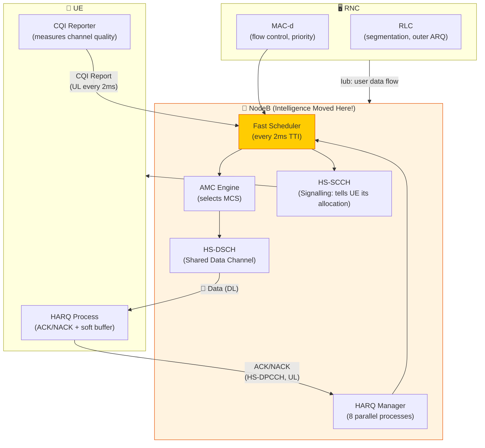

# ⚡ 3G HSPA / HSPA+

> **Links:** [← 3G UMTS](./03-3G-UMTS.md) | [README](./README.md) | [4G LTE →](./05-4G-LTE.md)

---

## 📋 What is HSPA?

**HSPA (High Speed Packet Access)** is NOT a new network — it's a **software and protocol upgrade** to existing UMTS networks. Think of it as a turbo mode for 3G.

HSPA = **HSDPA** (downlink boost) + **HSUPA** (uplink boost)

| Term | Full Name | 3GPP Release | Direction | Key Channel |
|---|---|---|---|---|
| **HSDPA** | High Speed Downlink Packet Access | Release 5 (2002) | Downlink | HS-DSCH |
| **HSUPA** | High Speed Uplink Packet Access | Release 6 (2005) | Uplink | E-DCH |
| **HSPA+** | Evolved HSPA | Release 7+ (2007+) | Both | Enhanced HS-DSCH/E-DCH |

> **Why HSPA matters:** UMTS R99 promised 2 Mbps but real-world speeds were often 384 kbps or less. Smartphones and mobile broadband were exploding — users needed more speed. HSPA delivered 10× improvement without building new networks. Operators just upgraded software on existing NodeBs.

---

## 📈 Speed Evolution Across Releases

| Release | Technology | Peak DL Speed | Peak UL Speed | Key Feature Added |
|---|---|---|---|---|
| **R99** | UMTS (baseline) | 384 kbps (practical) | 384 kbps | DCH channel, SF-based |
| **Rel 5** | HSDPA | **14.4 Mbps** | 384 kbps | HS-DSCH, 16-QAM, 2ms TTI |
| **Rel 6** | HSDPA + HSUPA | 14.4 Mbps | **5.76 Mbps** | E-DCH, 2ms/10ms TTI |
| **Rel 7** | HSPA+ | **21.1 Mbps** | 11.5 Mbps | 64-QAM DL, 16-QAM UL, MIMO 2×2 |
| **Rel 8** | HSPA+ (DC) | **42.2 Mbps** | 11.5 Mbps | Dual-Carrier HSDPA (DC-HSDPA) |
| **Rel 9** | HSPA+ (DC + MIMO) | **84.4 Mbps** | 23 Mbps | DC-HSDPA + MIMO, DC-HSUPA |
| **Rel 10** | HSPA+ (4C) | **168.8 Mbps** | 23 Mbps | 4-Carrier HSDPA |
| **Rel 11** | HSPA+ (8C) | **337.5 Mbps** | 69 Mbps | 8-Carrier HSDPA, UL MIMO |

> **🎯 Notice the pattern:** Each release roughly doubles the speed by adding one major capability: higher modulation, then MIMO, then more carriers. This evolutionary approach let operators get more value from existing infrastructure.

---

## 🔧 HSDPA: The 6 Key Mechanisms

🎯 HSDPA achieved its speed boost through **six coordinated innovations**. Each one is simple on its own — the magic is in combining them.

### 1. Higher Order Modulation (16-QAM)

**Basic UMTS:** QPSK only → 2 bits per symbol
**HSDPA:** QPSK + 16-QAM → up to 4 bits per symbol

**Analogy:** QPSK is like a delivery truck that can carry 2 boxes per trip. 16-QAM is a bigger truck carrying 4 boxes per trip — twice the capacity! But the bigger truck needs better roads (higher signal quality) to avoid losing boxes.

### 2. Shorter TTI (2 ms vs. 10–80 ms)

**Basic UMTS:** TTI = 10, 20, 40, or 80 ms
**HSDPA:** TTI = 2 ms (fixed)

**Analogy:** If you're playing a video game and something goes wrong, would you rather know in 2 ms or 80 ms? Shorter TTI means the system reacts **5–40× faster** to channel changes, errors, and scheduling decisions.

**Impact:** Faster retransmissions, faster scheduling adaptation, lower latency.

### 3. 🎯 Adaptive Modulation and Coding (AMC)

**Basic UMTS:** Fixed spreading factor, power control adjusts to maintain quality
**HSDPA:** Fixed power, **adapt the modulation and coding** to match current conditions

**Analogy:** It's exactly like YouTube auto-adjusting video quality:
- Good signal → 16-QAM, high code rate (1080p) → maximum throughput
- Bad signal → QPSK, low code rate (360p) → maintain connection, sacrifice speed

This is a **paradigm shift**: Instead of changing transmit power to fight bad channels (UMTS approach), HSDPA changes the data rate to match the channel. The NodeB selects from up to **30 transport format combinations** every 2 ms TTI.

### 4. Shared Channel (HS-DSCH)

**Basic UMTS:** DCH = dedicated channel per user (like having your own private highway lane)
**HSDPA:** HS-DSCH = shared channel (like a highway where everyone uses all lanes, managed by traffic control)

**Analogy:** Imagine 10 people each having their own dedicated road to work — most roads sit empty most of the time. Now imagine one wide highway with a smart traffic controller directing each car to the fastest lane available. The highway handles far more traffic.

**Key benefit:** **Statistical multiplexing gain** — not every user needs maximum bandwidth simultaneously, so sharing a pool is far more efficient than dedicating resources.

### 5. 🎯 Fast Scheduling at NodeB

**Basic UMTS:** Scheduling decisions made at the RNC (far from the radio)
**HSDPA:** Scheduling decisions made at the **NodeB** (right next to the radio)

**Analogy:** Would you rather have a traffic controller sitting in a helicopter 50 km away (RNC), or standing at the intersection seeing exactly what's happening (NodeB)? The NodeB can react to channel changes in **2 ms** because it has real-time channel quality information.

**Types of scheduling:**
- **Round Robin:** Equal turns (fair but inefficient)
- **Proportional Fair:** Balance between fairness and throughput (most common)
- **Max C/I:** Always serve the user with the best channel (maximum throughput, unfair)

### 6. 🎯 HARQ (Hybrid ARQ with Soft Combining)

**Basic UMTS:** If a packet fails, retransmit the same thing. Discard the failed copy.
**HSDPA:** If a packet fails, retransmit — but **keep the failed copy and combine it** with the retransmission for a better result!

**Analogy:** Imagine you receive a blurry photo. Instead of deleting it and asking for a new one, you keep it. When the new copy arrives (also slightly blurry), you overlay both copies — the combined image is much clearer than either alone.

**Two combining strategies:**
- **Chase Combining:** Retransmit identical packet, combine (simple, like averaging two photos)
- **Incremental Redundancy (IR):** Retransmit *different* redundancy bits, combine (more powerful, like getting a new angle of the same photo)

HARQ happens at the **NodeB** (not RNC), keeping the retransmission loop short (~8 ms round trip vs. 40+ ms to RNC).

---

## 📊 HSDPA Data Flow Architecture

**Key flow:**
1. UE continuously measures channel quality → reports **CQI** (Channel Quality Indicator) every 2 ms
2. NodeB scheduler uses CQI to decide: **which UE to serve**, **how much data**, **which modulation/coding**
3. Data sent on **HS-DSCH**, control info on **HS-SCCH** (tells UE its allocation 2 slots ahead)
4. UE attempts decoding → sends **ACK** (success) or **NACK** (fail, triggers HARQ retransmission)

---

## 📡 HSUPA (E-DCH): Uplink Enhancement

HSUPA was introduced in Release 6 to boost the uplink, using similar principles to HSDPA but adapted for the uplink's unique challenges.

| Feature | HSUPA (E-DCH) | HSDPA (HS-DSCH) |
|---|---|---|
| **Direction** | Uplink | Downlink |
| **Peak Speed** | 5.76 Mbps | 14.4 Mbps |
| **TTI Options** | 2 ms or 10 ms | 2 ms only |
| **Modulation** | BPSK & QPSK (Rel 6), 16-QAM (Rel 7) | QPSK & 16-QAM |
| **HARQ** | Yes (at NodeB) | Yes (at NodeB) |
| **Scheduling** | NodeB-controlled + autonomous | NodeB-controlled |
| **Channel Type** | Dedicated (E-DCH per user) | Shared (HS-DSCH for all users) |
| **Soft Handover** | ✅ Supported (macro diversity) | ❌ Not supported (serving cell only) |
| **Power Control** | Still needed (UL near-far problem) | Less critical (DL, NodeB controls power) |

> **Why is HSUPA's channel dedicated, not shared?** Because the **uplink near-far problem** still applies. Each UE needs its own code and power level. Sharing a single UL channel would be extremely complex to coordinate. DL sharing is simpler because the NodeB controls all transmissions from one point.

---

## 🚀 HSPA+ Enhancements

HSPA+ (Release 7 onwards) pushed 3G performance towards early 4G levels:

### Key HSPA+ Technologies

| Technology | Release | Description | Speed Impact |
|---|---|---|---|
| **64-QAM** | Rel 7 | 6 bits/symbol (vs. 4 for 16-QAM) on DL | 21.1 Mbps peak DL |
| **2×2 MIMO** | Rel 7 | Two spatial streams on DL | 28.8 Mbps peak DL |
| **16-QAM UL** | Rel 7 | Higher modulation on uplink | 11.5 Mbps peak UL |
| **DC-HSDPA** | Rel 8 | Two 5 MHz carriers combined on DL | 42.2 Mbps peak DL |
| **DC-HSDPA + MIMO** | Rel 9 | Dual-carrier + 2×2 MIMO | 84.4 Mbps peak DL |
| **DC-HSUPA** | Rel 9 | Two carriers on uplink | 23 Mbps peak UL |
| **4C-HSDPA** | Rel 10 | Four 5 MHz carriers on DL | 168.8 Mbps peak DL |
| **8C-HSDPA** | Rel 11 | Eight 5 MHz carriers on DL | 337.5 Mbps peak DL |

> **Dual-Carrier HSDPA (DC-HSDPA) explained:** Instead of using one 5 MHz WCDMA carrier, the UE simultaneously receives data on **two** 5 MHz carriers. It's like having two lanes on a highway instead of one — double the capacity (minus some overhead).

> **MIMO in HSPA+:** Uses two antennas at both NodeB and UE to create two independent spatial streams over the same frequency. When conditions are good, this doubles throughput. When conditions are poor, it falls back to diversity mode (improve reliability instead of speed).

---

## 📡 HSDPA Channel Structure

| Channel | Full Name | Direction | Purpose |
|---|---|---|---|
| **HS-DSCH** | High Speed Downlink Shared Channel | DL (Transport) | Main data channel — shared among all HSDPA users |
| **HS-PDSCH** | HS Physical Downlink Shared Channel | DL (Physical) | Physical layer mapping of HS-DSCH. Uses SF=16, up to 15 codes |
| **HS-SCCH** | HS Shared Control Channel | DL (Physical) | Tells UE: your modulation, codes, HARQ process, new data indicator. Sent 2 slots before HS-PDSCH |
| **HS-DPCCH** | HS Dedicated Physical Control Channel | UL (Physical) | UE sends: **CQI** (channel quality) and **ACK/NACK** (HARQ feedback) |

---

## 📊 HSPA vs. Basic UMTS Comparison

🎯 This table captures the paradigm shift from R99 to HSPA.

| Feature | UMTS R99 | HSDPA (Rel 5) | HSPA+ (Rel 8) |
|---|---|---|---|
| **Peak DL Speed** | 384 kbps | 14.4 Mbps | 42.2 Mbps |
| **Peak UL Speed** | 384 kbps | 384 kbps | 11.5 Mbps |
| **DL Channel** | DCH (dedicated) | HS-DSCH (shared) | HS-DSCH (shared) |
| **Modulation** | QPSK | QPSK + 16-QAM | QPSK + 16-QAM + 64-QAM |
| **TTI** | 10–80 ms | 2 ms | 2 ms |
| **Scheduling** | RNC (slow) | NodeB (fast, 2ms) | NodeB (fast, 2ms) |
| **HARQ** | RLC-level at RNC | L1 HARQ at NodeB | L1 HARQ at NodeB |
| **Power Adaptation** | Power control (vary power) | AMC (vary data rate) | AMC (vary data rate) |
| **Latency (RTT)** | ~150 ms | ~70 ms | ~30 ms |
| **MIMO** | No | No | 2×2 MIMO |
| **Multi-carrier** | No | No | DC-HSDPA (2 × 5 MHz) |

---

## 🎯 Why HSPA Matters for NDO (Network Design & Optimisation)

As an NDO engineer, you'll encounter many networks still running HSPA alongside LTE:

1. **Coverage fallback:** When LTE coverage ends, devices fall back to HSPA. Optimising this handover is critical for user experience.
2. **Capacity planning:** Understanding HSDPA scheduling helps optimise cell throughput — proportional fair scheduling, CQI distribution, and code utilisation are key KPIs.
3. **Code congestion:** With SF=16, there are only 16 codes. HSDPA can use up to 15 of them. Monitoring code usage prevents bottlenecks.
4. **HARQ efficiency:** High NACK rates indicate poor radio conditions. Monitoring HARQ statistics helps identify coverage gaps.
5. **DC-HSDPA carriers:** Carrier aggregation adds complexity in inter-frequency mobility. NDO engineers manage carrier activation/deactivation thresholds.

---

## 🧪 Quiz

**1. What are the six key mechanisms that make HSDPA faster than basic UMTS?**

Show Answer

1. **Higher-order modulation** (16-QAM → 4 bits/symbol vs. QPSK → 2 bits/symbol)
2. **Shorter TTI** (2 ms vs. 10–80 ms → faster reactions)
3. **Adaptive Modulation and Coding (AMC)** (adapt rate to channel, instead of adapting power)
4. **Shared channel (HS-DSCH)** (statistical multiplexing vs. dedicated DCH)
5. **Fast scheduling at NodeB** (2 ms scheduling cycles, close to the radio)
6. **HARQ with soft combining** (keep failed copies, combine with retransmissions)

**2. 🎯 Explain the paradigm shift from power control (UMTS R99) to AMC (HSDPA).**

Show Answer

In **UMTS R99**, when channel conditions worsen, the system increases transmit power to maintain the same data rate. This wastes power and increases interference for other users.

In **HSDPA (AMC)**, transmit power stays relatively constant. Instead, when channel conditions worsen, the system **reduces the data rate** (lower modulation, more coding) to maintain connection reliability. When conditions improve, it increases the data rate (higher modulation, less coding) to maximise throughput. This is far more efficient because it avoids unnecessary interference increases.

**3. Why does HSDPA move scheduling from the RNC to the NodeB?**

Show Answer

The NodeB is **physically closest to the radio interface** and has real-time access to channel quality information (CQI reports from UEs). The RNC is further away with additional latency. Moving scheduling to the NodeB enables:
- **2 ms scheduling cycles** (vs. tens of ms via RNC)
- **Immediate reaction** to channel condition changes
- **Fast HARQ retransmissions** (~8 ms round trip vs. ~40+ ms via RNC)
- **Better multi-user diversity** exploitation (serve the user with the best channel right now)

**4. How does HARQ with soft combining improve performance?**

Show Answer

Traditional ARQ discards a failed packet and retransmits a new copy. HARQ **keeps the failed packet in a soft buffer** and combines it with the retransmission:
- **Chase Combining:** Retransmit the identical packet. Combining two noisy copies averages out the noise → better SNR.
- **Incremental Redundancy (IR):** Retransmit different redundancy bits. The decoder now has more information to work with → even higher success probability.

Result: Higher probability of successful decoding after retransmission, often achieving the target BLER in just 1–2 retransmissions.

**5. 🎯 Why does HSDPA not support soft handover, while HSUPA does?**

Show Answer

**HSDPA** uses a **shared channel (HS-DSCH)** with fast NodeB scheduling. Soft handover would require coordinating HS-DSCH scheduling across multiple NodeBs simultaneously, which is extremely complex and would negate the fast scheduling advantage. Instead, HSDPA uses **serving cell change** (a fast hard handover-like mechanism).

**HSUPA** uses a **dedicated channel (E-DCH)** per user. The uplink signal naturally arrives at multiple NodeBs (it's broadcast into the air), so macro diversity combining is straightforward — each NodeB decodes independently and the RNC selects the best result. This soft handover support gives HSUPA better UL coverage at cell edges.

**6. What is DC-HSDPA and why was it introduced?**

Show Answer

**DC-HSDPA (Dual-Carrier HSDPA)**, introduced in Release 8, allows a UE to simultaneously receive data on **two** 5 MHz WCDMA carriers. This effectively doubles the peak throughput to 42.2 Mbps. It was introduced because:
- Single-carrier HSDPA was approaching its theoretical maximum
- Operators had multiple 5 MHz carriers available
- It provides **carrier aggregation gain**: schedule users on whichever carrier has less load
- It was a software upgrade, not requiring new hardware in many cases

**7. In the HSDPA speed evolution, what technique doubles speed at each release?**

Show Answer

Each release roughly doubles speed by adding one major capability:
- **Rel 5:** Base HSDPA → 14.4 Mbps (16-QAM, AMC, shared channel)
- **Rel 7:** **64-QAM** → 21 Mbps (50% more bits per symbol)
- **Rel 8:** **Dual-Carrier** → 42 Mbps (two 5 MHz carriers)
- **Rel 9:** **DC + MIMO** → 84 Mbps (two spatial streams)
- **Rel 10:** **4-Carrier** → 168 Mbps (four carriers)
- **Rel 11:** **8-Carrier** → 337 Mbps (eight carriers)

The pattern is: higher modulation → spatial multiplexing (MIMO) → carrier aggregation → more carriers.

