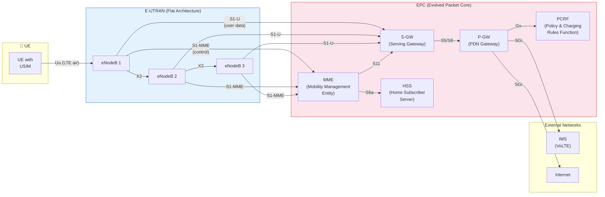
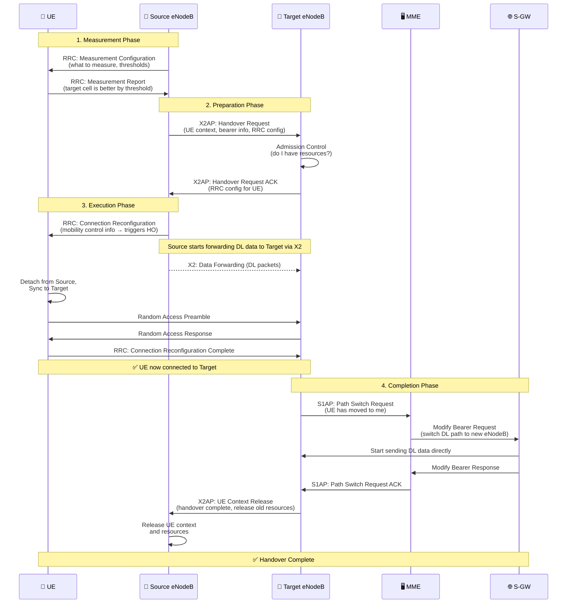

# 📱 4G LTE (Long Term Evolution)

> **Links:** [← 3G HSPA](./04-3G-HSPA.md) | [README](./README.md) | [LTE Advanced →](./06-4G-LTE-Advanced.md)

---

## 📋 Overview at a Glance

| Parameter | Value |
|---|---|
| **Full Name** | Long Term Evolution (E-UTRA / EPS) |
| **3GPP Release** | Release 8 (2008) |
| **DL Access** | OFDMA (Orthogonal Frequency Division Multiple Access) |
| **UL Access** | SC-FDMA (Single Carrier FDMA) |
| **Peak DL Speed** | 100 Mbps (Cat 3) → 300 Mbps (Cat 5, 4×4 MIMO) |
| **Peak UL Speed** | 50 Mbps (Cat 3) → 75 Mbps (Cat 5) |
| **Latency (RTT)** | ~10 ms (user plane), ~50 ms (control plane) |
| **Bandwidth Options** | 1.4, 3, 5, 10, 15, 20 MHz |
| **Duplex** | FDD and TDD |
| **Core Network** | EPC (Evolved Packet Core) — ALL IP, ALL packet-switched |
| **Modulation** | QPSK, 16-QAM, 64-QAM |

---

## 🎯 THE Key Shift: No More Circuit Switching

> [!IMPORTANT]
> LTE is the **first mobile generation with NO circuit-switched domain**. Everything — voice, video, data — runs over IP packets. This is arguably the most fundamental architectural change in mobile history.

**What this means:**
- **No MSC, no VLR** — circuit-switched core is gone
- Voice is handled by **VoLTE** (Voice over LTE) using the **IMS** framework, or falls back to 2G/3G (CSFB)
- The entire architecture is **flat** and **all-IP** — massively simpler, lower cost, lower latency
- SMS is delivered over IP (via IMS) or via the SGs interface as a fallback

**Why this matters for NDO:** Understanding VoLTE quality, CSFB success rate, and the interworking between LTE and legacy networks are critical NDO KPIs.

---

## 🏗️ EPS Architecture (Evolved Packet System)

EPS = **E-UTRAN** (radio) + **EPC** (core). The entire system is designed around IP from day one.



### 🎯 E-UTRAN: The Flat Architecture Revolution

**The single most important architectural change:** LTE eliminated the controller node (RNC/BSC). The **eNodeB** is now the only node in the RAN.

| Aspect | 2G (GSM) | 3G (UMTS) | 4G (LTE) |
|---|---|---|---|
| **RAN Nodes** | BTS → BSC | NodeB → RNC | eNodeB only |
| **Number of RAN layers** | 2 | 2 | **1 (flat!)** |
| **Intelligence location** | BSC | RNC | **eNodeB** |
| **Inter-BS interface** | ❌ None | ❌ None (Iur is RNC↔RNC) | ✅ **X2 (eNB↔eNB)** |
| **Handover decision** | BSC | RNC | **eNodeB** |
| **RRM (Radio Resource Mgmt)** | BSC | RNC | **eNodeB** |

**Why flatten?**
- **Lower latency:** No extra hop through RNC. Data goes eNodeB → S-GW → Internet directly.
- **Lower cost:** One less hardware node to buy, power, and maintain per site
- **Faster handover:** eNodeBs communicate directly via X2, no waiting for RNC decisions
- **Simpler scaling:** Add eNodeBs independently, no RNC bottleneck

### 🎯 Key Interfaces

| Interface | Connects | Protocol | Purpose |
|---|---|---|---|
| **S1-MME** | eNodeB ↔ MME | S1AP over SCTP | Control plane: attach, handover, paging, security |
| **S1-U** | eNodeB ↔ S-GW | GTP-U over UDP | User plane: tunnelled IP data packets |
| **X2** | eNodeB ↔ eNodeB | X2AP + GTP-U | Handover, interference coordination, load balancing |
| **S6a** | MME ↔ HSS | Diameter | Authentication, subscription data retrieval |
| **S5/S8** | S-GW ↔ P-GW | GTP | Bearer management, routing to PDN |
| **S11** | MME ↔ S-GW | GTP-C | Session management, bearer setup/teardown |
| **Gx** | P-GW ↔ PCRF | Diameter | QoS policy, charging rules |
| **SGi** | P-GW ↔ External | IP | Connection to Internet, IMS, etc. |

### 🎯 EPC Nodes Detailed

| Node | Full Name | Role | Analogy |
|---|---|---|---|
| **MME** | Mobility Management Entity | **Control plane brain of EPC.** Handles: attach/detach, authentication, NAS security, tracking area updates, paging, bearer management signalling, handover signalling. Does NOT touch user data. | Air traffic controller — directs planes but doesn't carry passengers |
| **S-GW** | Serving Gateway | **User plane anchor within the operator's network.** Routes/forwards packets, local mobility anchor for inter-eNB handover, handles lawful intercept, charging data collection. One per UE at a time. | Local post office — sorts and forwards mail within your region |
| **P-GW** | PDN Gateway | **User plane anchor to external networks.** Assigns IP address to UE, enforces QoS and policy (from PCRF), performs NAT, connects to Internet/IMS. Anchor point for inter-operator roaming. | International post office — connects your letters to the outside world |
| **HSS** | Home Subscriber Server | **Central database of all subscriber info.** Stores: IMSI, authentication vectors, subscribed QoS, allowed APNs, roaming restrictions. Evolution of HLR. | Master registry — knows everything about every citizen |
| **PCRF** | Policy & Charging Rules Function | **Policy decision engine.** Determines QoS parameters and charging rules per session/flow. Tells P-GW how to treat each traffic flow (prioritise VoLTE, throttle video, etc.) | Judge — decides the rules each traffic flow must follow |

---

## 📡 OFDM: The Foundation of LTE

### 🎯 The Truck Analogy

**Old approach (CDMA/WCDMA):** Send data using ONE very fast truck on a wide highway. If the truck hits a pothole (deep fade at one frequency), the entire load is damaged.

**OFDM approach:** Instead of one fast truck, use **many slow trucks in parallel**, each carrying a small piece of the data on its own narrow lane. If one truck hits a pothole, only that small piece is lost — the rest arrive safely. Error correction recovers the lost piece.

**Technically:**
- The 5–20 MHz LTE bandwidth is divided into **hundreds or thousands of narrow subcarriers** (each 15 kHz wide)
- Each subcarrier carries data independently at a **low symbol rate** (no ISI problems!)
- All subcarriers transmit simultaneously in parallel → high aggregate data rate
- Because each subcarrier is narrow (15 kHz), it experiences **flat fading** — easy to equalize (just one complex multiplication per subcarrier vs. a complex equalizer in WCDMA)

### Why "Orthogonal"?

**Orthogonal means the subcarriers don't interfere with each other**, even though they overlap in frequency! This seems like magic, but it works because of a precise mathematical relationship: subcarriers are spaced exactly **1/T** apart (where T is the symbol duration), making them orthogonal over one symbol period.

**Analogy:** Think of tuning forks. Each tuning fork vibrates at a specific frequency. If you place them side by side and strike one, only that specific tuning fork resonates — the others stay silent because they're tuned to different frequencies. OFDM subcarriers work the same way.

### 🎯 Cyclic Prefix (CP): Preventing Pileups

**The problem:** In real-world propagation, multipath causes delayed copies of each OFDM symbol to overlap with the next symbol (Inter-Symbol Interference).

**The solution:** Add a **Cyclic Prefix** — copy the END of each symbol and paste it at the BEGINNING. This creates a **guard interval**.

**Analogy:** It's like spacing between trucks in a convoy. If a truck (symbol) is delayed by multipath, the spacing (CP) ensures it doesn't crash into the truck in front. The CP is chosen to be longer than the maximum expected multipath delay.

| CP Type | Duration | Use Case |
|---|---|---|
| **Normal CP** | 4.7 μs | Most deployments (handles multipath up to ~1.4 km path difference) |
| **Extended CP** | 16.7 μs | Large cells, hilly terrain, MBSFN (single-frequency broadcast) |

> **CP overhead:** Normal CP wastes about 7% of capacity (4.7 μs / 71.4 μs). Extended CP wastes about 25%. This is the "cost" of multipath protection.

---

## 🎯 OFDMA vs. SC-FDMA: THE Interview Question

### Why Not Use OFDMA on the Uplink Too?

This is one of the most commonly asked LTE interview questions. The answer is **PAPR (Peak-to-Average Power Ratio)**.

| Feature | OFDMA (Downlink) | SC-FDMA (Uplink) |
|---|---|---|
| **Used in** | Downlink (eNodeB → UE) | Uplink (UE → eNodeB) |
| **PAPR** | **High** (many subcarriers add up → occasional very high peaks) | **Low** (single-carrier-like signal with lower peaks) |
| **Why it matters** | eNodeB has mains power, expensive linear amplifier — no problem | UE runs on battery, needs efficient power amplifier |
| **Power Amplifier** | Can use expensive, high-linearity amplifier at eNodeB | Must use cheaper, efficient amplifier in UE handset |
| **Spectral Efficiency** | Slightly higher | Slightly lower (~1-2 dB penalty) |
| **Complexity** | Standard OFDM processing | Additional DFT pre-coding step |

**🎯 The Core Reason:**

OFDMA transmits many subcarriers simultaneously. Occasionally, these subcarriers' peaks align constructively, creating very high instantaneous power spikes (high PAPR). To handle these spikes without distortion, you need a very **linear power amplifier** with a large **back-off** — meaning the amplifier operates far below its maximum capacity most of the time → **wasteful and power-hungry**.

SC-FDMA adds a **DFT pre-coding** step before the OFDM modulation. This transforms the multi-carrier signal back into something that resembles a **single-carrier signal** with much lower PAPR. Result: the UE's power amplifier can operate closer to its maximum efficiency → **better battery life**.

**Bottom line:** SC-FDMA exists on the uplink **solely** to save UE battery power by reducing PAPR, enabling a more efficient power amplifier design. The eNodeB can afford the power-hungry OFDMA amplifier because it has mains power.

---

## 📐 LTE Resource Grid

The LTE resource grid is the fundamental framework for resource allocation. Everything in LTE maps to this grid.

### Time Domain Structure

```
Frame (10 ms)
├── Subframe 0 (1 ms) ──── the basic scheduling unit (TTI)
│   ├── Slot 0 (0.5 ms) ── 7 OFDM symbols (normal CP) or 6 (extended CP)
│   └── Slot 1 (0.5 ms) ── 7 OFDM symbols (normal CP) or 6 (extended CP)
├── Subframe 1 (1 ms)
├── Subframe 2 (1 ms)
│   ...
└── Subframe 9 (1 ms)
```

| Unit | Duration | Contents |
|---|---|---|
| **OFDM Symbol** | ~71.4 μs (including CP) | Smallest time unit; one "column" of the grid |
| **Slot** | 0.5 ms | 7 OFDM symbols (normal CP) |
| **Subframe (TTI)** | 1 ms | 2 slots = 14 OFDM symbols. **Basic scheduling interval.** |
| **Frame** | 10 ms | 10 subframes = 20 slots |

### Frequency Domain Structure

| Unit | Bandwidth | Description |
|---|---|---|
| **Subcarrier** | 15 kHz | Smallest frequency unit; one "row" of the grid |
| **Resource Element (RE)** | 1 subcarrier × 1 OFDM symbol | **Smallest allocatable unit** — carries one modulated symbol |
| **Resource Block (RB)** | 12 subcarriers × 1 slot (0.5 ms) = 180 kHz × 0.5 ms | **Basic allocation unit** for scheduling |
| **RB pair** | 12 subcarriers × 1 subframe (1 ms) | What the scheduler actually allocates (2 consecutive RBs) |

### 🎯 Bandwidth vs. Resource Blocks

| System BW | Number of RBs | Number of Subcarriers | Approx. Peak DL (64-QAM, SISO) |
|---|---|---|---|
| **1.4 MHz** | 6 | 72 | ~4 Mbps |
| **3 MHz** | 15 | 180 | ~10 Mbps |
| **5 MHz** | 25 | 300 | ~18 Mbps |
| **10 MHz** | 50 | 600 | ~36 Mbps |
| **15 MHz** | 75 | 900 | ~55 Mbps |
| **20 MHz** | 100 | 1200 | ~75 Mbps |

> **🎯 Why 20 MHz = 100 RBs is key:** This is the maximum LTE bandwidth per carrier. 100 RBs × 12 subcarriers = 1200 subcarriers × 15 kHz = 18 MHz (occupied) in 20 MHz (allocated). LTE-Advanced achieves higher bandwidth by aggregating multiple 20 MHz carriers.

---

## 📡 MIMO in LTE

🎯 MIMO (Multiple Input Multiple Output) is critical for LTE's performance. LTE supports several MIMO configurations:

| Mode | Antennas | Purpose | When Used |
|---|---|---|---|
| **SISO** | 1 TX, 1 RX | Baseline — single stream | Simplest devices |
| **Receive Diversity** | 1 TX, 2 RX | Combine two received copies for reliability | Standard minimum in LTE UEs |
| **Transmit Diversity** | 2 TX, 1+ RX | Send same data on 2 antennas with space-frequency coding (SFBC) | Poor channel conditions — maximize reliability |
| **Spatial Multiplexing (Open Loop)** | 2+ TX, 2+ RX | Send **different data on each antenna** — multiply throughput! | Good channel conditions — maximize speed |
| **Spatial Multiplexing (Closed Loop)** | 2+ TX, 2+ RX | Same as above but uses **precoding** based on UE feedback (PMI) | Better than open loop when feedback is timely |
| **Beamforming** | 4–8+ TX, 1+ RX | Focus signal energy toward the UE's location | Cell-edge users, TDD deployments |
| **MU-MIMO** | 2+ TX, multiple UEs | Serve **multiple UEs simultaneously** on the same RBs with different beams | High-load scenarios, maximize cell capacity |

> **🎯 Key for interviews:**
> - LTE Rel 8 supports up to **4×4 MIMO** in DL (4 layers → 4× throughput in theory)
> - UL is limited to **1 TX antenna** in Rel 8 (no UL MIMO until LTE-A)
> - The eNodeB selects the MIMO mode dynamically based on channel conditions (reported by UE via **Rank Indicator (RI)** and **PMI**)

---

## 📚 LTE Protocol Stack

| Layer | Protocol | Direction | Key Functions |
|---|---|---|---|
| **NAS** | NAS (Non-Access Stratum) | UE ↔ MME | EMM (attach, auth, TAU), ESM (bearer management). Transparent to eNodeB. 🎯 |
| **RRC** | Radio Resource Control | UE ↔ eNodeB | Connection setup/release, handover, measurement config, SIBs broadcast, security activation. **Two states: RRC_IDLE and RRC_CONNECTED.** 🎯 |
| **PDCP** | Packet Data Convergence Protocol | UE ↔ eNodeB | Header compression (ROHC — saves ~40 bytes/packet for VoIP!), ciphering (encryption), integrity protection (control plane), sequence numbering, duplicate detection, in-order delivery during handover |
| **RLC** | Radio Link Control | UE ↔ eNodeB | Segmentation/reassembly of PDCP PDUs, ARQ (retransmission). **Three modes:** TM (transparent), UM (unacknowledged — VoIP), AM (acknowledged — TCP traffic) 🎯 |
| **MAC** | Medium Access Control | UE ↔ eNodeB | Scheduling (decides which UE gets which RBs each TTI), HARQ, multiplexing logical channels onto transport channels, Random Access procedure, BSR (Buffer Status Report), PHR (Power Headroom Report) |
| **PHY** | Physical Layer | UE ↔ eNodeB | OFDMA/SC-FDMA modulation, coding (turbo codes), MIMO processing, CQI/RI/PMI measurement, cell search, synchronization |

### 🎯 RRC States

| State | Description | UE Activity | Network Resources |
|---|---|---|---|
| **RRC_IDLE** | UE is registered but has no active connection | Monitors paging (DRX), cell reselection, reads SIBs | No dedicated resources, no S1 bearer |
| **RRC_CONNECTED** | UE has an active RRC connection with eNodeB | Sends/receives data, reports measurements, handover-capable | Dedicated resources allocated, S1/X2 bearers active |

**Transition:** RRC_IDLE → RRC_CONNECTED via **Random Access + RRC Connection Setup**. The reverse happens after an inactivity timer expires.

---

## 📡 LTE Channel Structure

### Downlink Channels

| Channel | Full Name | Type | Purpose |
|---|---|---|---|
| **PDSCH** | Physical DL Shared Channel | Data | **Main data channel** — all user data and most signalling (RRC, NAS). Shared among all users via scheduling. 🎯 |
| **PDCCH** | Physical DL Control Channel | Control | **Scheduling grants** (DCI — Downlink Control Information): tells each UE which RBs are assigned, MCS, MIMO mode, power control. In first 1–3 OFDM symbols. 🎯 |
| **PBCH** | Physical Broadcast Channel | Broadcast | Carries **MIB** (Master Information Block): system bandwidth, SFN, PHICH config. In center 6 RBs, every 40 ms. |
| **PCFICH** | Physical Control Format Indicator Channel | Control | Tells UE how many OFDM symbols (1, 2, or 3) are used for PDCCH in this subframe. First OFDM symbol. |
| **PHICH** | Physical HARQ Indicator Channel | Control | Sends **ACK/NACK** for UL HARQ — tells UE if its uplink data was received. |

### Uplink Channels

| Channel | Full Name | Type | Purpose |
|---|---|---|---|
| **PUSCH** | Physical UL Shared Channel | Data | **Main UL data channel** — user data, RRC messages, BSR, PHR. Shared via scheduling. |
| **PUCCH** | Physical UL Control Channel | Control | UE sends: **CQI/PMI/RI** (channel quality), **HARQ ACK/NACK** (DL feedback), **Scheduling Request (SR)**. At band edges. |
| **PRACH** | Physical Random Access Channel | Access | Initial access, handover, sync recovery. UE transmits a **preamble** (64 available, from Zadoff-Chu sequences). |

### Reference Signals (Not Channels, But Critical)

| Signal | Full Name | Direction | Purpose |
|---|---|---|---|
| **CRS** | Cell-Specific Reference Signal | DL | Channel estimation, CQI measurement, cell-level demodulation. Known pattern embedded across all RBs. Every eNodeB transmits. 🎯 |
| **DM-RS** | Demodulation Reference Signal | DL & UL | UE-specific channel estimation. Used for beamforming and advanced MIMO modes. Only in allocated RBs. |
| **SRS** | Sounding Reference Signal | UL | UE transmits across the bandwidth so eNodeB can estimate **UL channel quality** across all frequencies. Used for frequency-selective scheduling. |
| **PSS/SSS** | Primary/Secondary Sync Signals | DL | Cell search: PSS identifies sector (0, 1, 2), SSS identifies cell ID group (0–167). Together → **504 unique Physical Cell IDs.** 🎯 |

---

## 🔄 X2-Based Handover (Intra-LTE)

🎯 This is the most common handover type in LTE and a frequent interview topic. The key advantage: **no core network involvement for user plane** — the eNodeBs handle it directly via X2.



### Handover Steps Summary

| Phase | Steps | Key Point |
|---|---|---|
| **1. Measurement** | eNB configures UE, UE measures & reports | Event-triggered (A3: neighbor better than serving by offset) |
| **2. Preparation** | Source → Target: HO Request + ACK via X2 | Target performs **admission control** (checks resources) |
| **3. Execution** | RRC Reconfiguration, RACH to target, data forwarding | Brief interruption (~20-50 ms). Source forwards buffered data via X2. |
| **4. Completion** | Path Switch via MME/S-GW, release old resources | S-GW switches the DL data path to the new eNodeB |

> **🎯 Key interview points:**
> - X2 handover is **"make before break" in preparation, but hard handover in execution"** — there's still a brief interruption when the UE detaches from source and attaches to target
> - **No soft handover in LTE** — OFDMA doesn't support it (different cells use different time/frequency resources, unlike CDMA where all cells use the same code space)
> - If X2 is unavailable, handover falls back to **S1-based handover** (via MME), which is slower
> - The **data forwarding** step prevents packet loss during the brief interruption

---

## 📞 VoLTE: Voice over LTE

### Why VoLTE is Needed

🎯 Since LTE has **no circuit-switched domain**, there's no native way to make traditional voice calls. Three options exist:

| Solution | Mechanism | Quality | Disadvantage |
|---|---|---|---|
| **CSFB (Circuit Switched Fallback)** | Drop to 2G/3G for voice calls | Legacy voice quality | Call setup delay (2-4 sec), drops LTE data |
| **VoLTE (Voice over LTE)** | Voice as IP packets over LTE, using IMS | **HD Voice** (AMR-WB, EVS) | Requires IMS infrastructure, VoLTE-capable devices |
| **OTT VoIP** | Apps like WhatsApp, Skype | Variable | No operator control, no emergency calling |

### IMS Architecture (Simplified)

| Node | Full Name | Function |
|---|---|---|
| **P-CSCF** | Proxy Call Session Control Function | First contact point for UE. SIP proxy, QoS policy enforcement, security (IPsec) |
| **I-CSCF** | Interrogating CSCF | Entry point for incoming SIP requests. Queries HSS to find the correct S-CSCF |
| **S-CSCF** | Serving CSCF | Core SIP registrar and session controller. Handles call routing, service triggers |
| **HSS** | Home Subscriber Server | Subscriber data, service profiles (shared with EPC HSS) |
| **MGCF** | Media Gateway Control Function | Interworking with PSTN (for calls to landlines/non-VoLTE phones) |
| **TAS** | Telephony Application Server | Supplementary services: call waiting, forwarding, conferencing, etc. |

### 🎯 SRVCC (Single Radio Voice Call Continuity)

**The problem:** A user is on a VoLTE call and moves to an area with no LTE coverage (only 3G/2G).

**The solution:** SRVCC seamlessly hands over the voice call from **VoLTE (packet-switched over LTE)** to **circuit-switched voice on 3G/2G**, without the user noticing a drop.

**NDO relevance:** SRVCC success rate is a critical KPI. A failed SRVCC means a dropped call — one of the worst user experiences.

---

## 📊 LTE vs. UMTS Comparison

| Feature | UMTS (3G) | LTE (4G) |
|---|---|---|
| **Access Method** | WCDMA | OFDMA (DL) / SC-FDMA (UL) |
| **Bandwidth** | 5 MHz fixed | 1.4 – 20 MHz (flexible) |
| **Peak DL Speed** | 2 Mbps (R99), 14.4 Mbps (HSDPA) | 100–300 Mbps |
| **Latency (RTT)** | ~100–150 ms | ~10 ms |
| **Core Network** | CS + PS domains | **PS only** (EPC, all-IP) |
| **RAN Architecture** | NodeB → RNC (hierarchical) | eNodeB only (flat) |
| **Inter-BS Interface** | Iur (RNC↔RNC) | X2 (eNB↔eNB) |
| **Handover** | Soft + Hard | Hard only (X2-based) |
| **Voice** | Circuit-switched (MSC) | VoLTE (IMS) or CSFB |
| **MIMO** | Not in R99, 2×2 in HSPA+ | 2×2 or 4×4 |
| **Scheduling Interval** | 2 ms (HSDPA), 10+ ms (R99) | 1 ms (TTI) |
| **Modulation** | QPSK (R99), up to 64-QAM (HSPA+) | QPSK, 16-QAM, 64-QAM |
| **Frequency Reuse** | 1 (CDMA, interference-limited) | 1 (OFDMA, managed by ICIC/eICIC) |
| **Power Control** | Critical (1500 Hz fast PC) | Less critical (OFDMA is interference-resilient) |

---

## 🧪 Quiz

**1. 🎯 Why does LTE use OFDMA on the downlink but SC-FDMA on the uplink?**
<details>
<summary>Show Answer</summary>

The sole reason is **PAPR (Peak-to-Average Power Ratio)**. OFDMA has high PAPR because many subcarriers' peaks can occasionally align, creating very high instantaneous power spikes. At the eNodeB (downlink), this is manageable because it has mains power and can use expensive, high-linearity power amplifiers. But at the UE (uplink), high PAPR would require an inefficient power amplifier with large back-off, draining the battery quickly. SC-FDMA adds a DFT pre-coding step that reduces PAPR by ~2–3 dB, allowing the UE to use a more efficient power amplifier → **better battery life**.
</details>

**2. What is the significance of LTE having no circuit-switched domain?**
<details>
<summary>Show Answer</summary>

LTE is the first mobile generation that is **entirely packet-switched (all-IP)**. This means:
- No MSC, no VLR — the circuit-switched core is eliminated
- Voice must be carried as IP packets using **VoLTE** (via IMS framework) or fall back to 2G/3G via **CSFB**
- The architecture is simpler, cheaper, and lower latency (fewer nodes, all-IP)
- This represents the biggest architectural shift in mobile history — moving from a telephony-centric to a data-centric design
</details>

**3. 🎯 Describe the role of MME, S-GW, and P-GW in the EPC.**
<details>
<summary>Show Answer</summary>

- **MME (Mobility Management Entity):** Control plane only. Handles authentication, security, NAS signalling, tracking area updates, paging, handover signalling, and bearer management. It never touches user data.
- **S-GW (Serving Gateway):** User plane within the operator network. Routes and forwards user data packets, acts as local mobility anchor during inter-eNB handovers, handles charging data collection.
- **P-GW (PDN Gateway):** User plane anchor to external networks. Assigns the UE's IP address, enforces QoS/policy rules (from PCRF), connects to the Internet and IMS, and acts as the anchor for inter-operator mobility.

Key distinction: MME is pure control plane; S-GW and P-GW handle user plane. S-GW is the internal anchor; P-GW is the external anchor.
</details>

**4. How many Resource Blocks are available in a 20 MHz LTE carrier, and how is a Resource Block defined?**
<details>
<summary>Show Answer</summary>

A **20 MHz** LTE carrier has **100 Resource Blocks**. Each Resource Block = **12 subcarriers × 1 slot (0.5 ms)** = 180 kHz × 0.5 ms. This contains **12 × 7 = 84 Resource Elements** (with normal CP). The scheduler allocates RBs in pairs (1 subframe = 1 ms = 2 slots). So the scheduler actually works with 100 RB-pairs per subframe per 1 ms TTI. 100 RBs × 12 subcarriers = 1,200 subcarriers × 15 kHz = 18 MHz occupied bandwidth within the 20 MHz channel.
</details>

**5. 🎯 Explain the X2-based handover process in LTE.**
<details>
<summary>Show Answer</summary>

The X2-based handover has 4 phases:
1. **Measurement:** Source eNB configures UE to measure neighbor cells. UE sends Measurement Report when event A3 is triggered (neighbor better than serving by offset).
2. **Preparation:** Source sends Handover Request to Target via X2. Target performs admission control and sends back HO Request ACK with RRC configuration.
3. **Execution:** Source sends RRC Connection Reconfiguration to UE. Source starts forwarding buffered DL data to Target via X2. UE detaches from source, performs RACH to target, sends RRC Reconfiguration Complete.
4. **Completion:** Target sends Path Switch Request to MME. MME instructs S-GW to redirect DL data to Target eNB. Target tells Source to release UE context.

Key: User plane switches at the eNB level via X2 first (fast), then S-GW path is updated (slightly later). Brief interruption (~20-50 ms).
</details>

**6. What is the Cyclic Prefix in LTE, and why is it needed?**
<details>
<summary>Show Answer</summary>

The **Cyclic Prefix (CP)** is a guard interval added at the beginning of each OFDM symbol. It's created by copying the **last portion** of the symbol and prepending it. It's needed because:
- Multipath propagation causes delayed copies of the signal to arrive at different times
- Without CP, these delayed copies would overlap with the next symbol → **Inter-Symbol Interference (ISI)**
- The CP absorbs these delays: as long as the maximum multipath delay is less than the CP duration, ISI is eliminated

LTE uses two CP lengths: **Normal CP (4.7 μs)** for most deployments, and **Extended CP (16.7 μs)** for large cells or MBSFN. The trade-off is that CP wastes capacity (7% for normal CP) but is essential for reliable OFDM operation.
</details>

**7. What is SRVCC, and why is it important for NDO engineers?**
<details>
<summary>Show Answer</summary>

**SRVCC (Single Radio Voice Call Continuity)** is the mechanism that hands over an active VoLTE call from LTE (packet-switched) to 2G/3G (circuit-switched) when the UE moves out of LTE coverage. It's important for NDO because:
- SRVCC success rate is a **critical KPI** — a failed SRVCC = a dropped call
- NDO engineers must optimise LTE coverage borders and handover thresholds to ensure smooth SRVCC
- Monitoring SRVCC events helps identify areas where LTE coverage is insufficient
- It's needed until VoLTE coverage is ubiquitous enough to eliminate CS fallback entirely
</details>

**8. 🎯 Why is LTE's architecture called "flat," and what advantages does this provide?**
<details>
<summary>Show Answer</summary>

LTE's architecture is called "flat" because it has **only one node in the RAN — the eNodeB**. Previous generations had hierarchical architectures: GSM had BTS → BSC (2 layers), UMTS had NodeB → RNC (2 layers). LTE eliminated the controller node entirely, making the eNodeB the single intelligent RAN element.

Advantages:
1. **Lower latency:** No extra hop through an intermediate controller. Data goes directly from eNodeB to S-GW.
2. **Faster handover:** eNodeBs communicate directly via X2 without waiting for a centralized controller's decision.
3. **Lower cost:** One less node to deploy, power, cool, and maintain.
4. **Better scalability:** Add eNodeBs independently without worrying about RNC capacity limits.
5. **Simplified architecture:** Fewer interfaces, fewer potential failure points.

The trade-off is that eNodeBs must be more intelligent and must coordinate with each other via X2 for functions previously handled centrally (like interference coordination).
</details>
