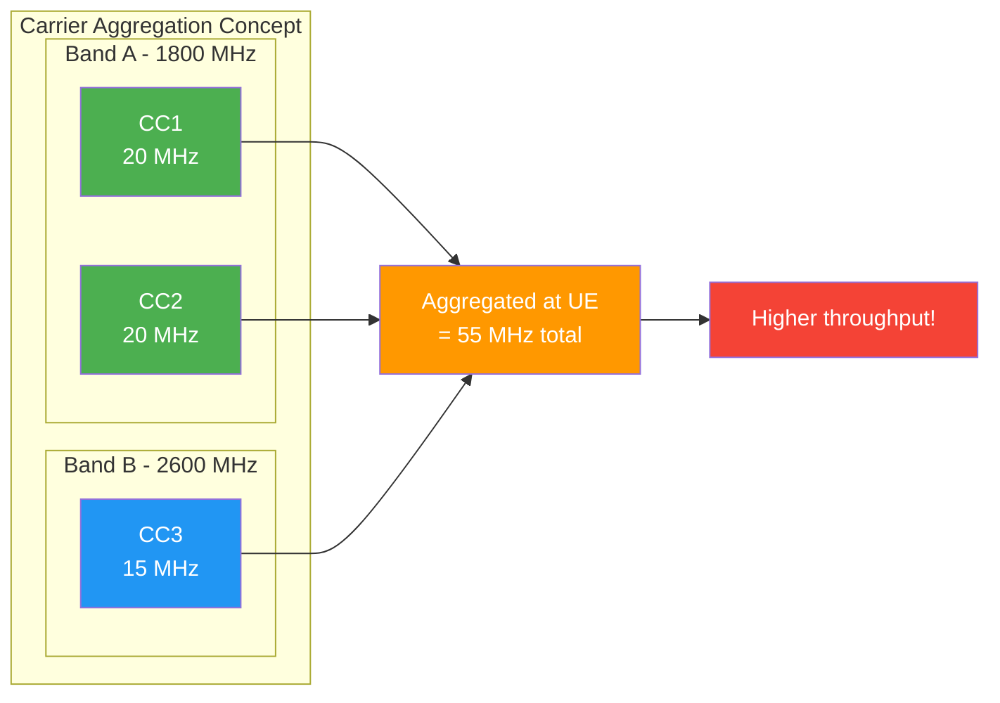
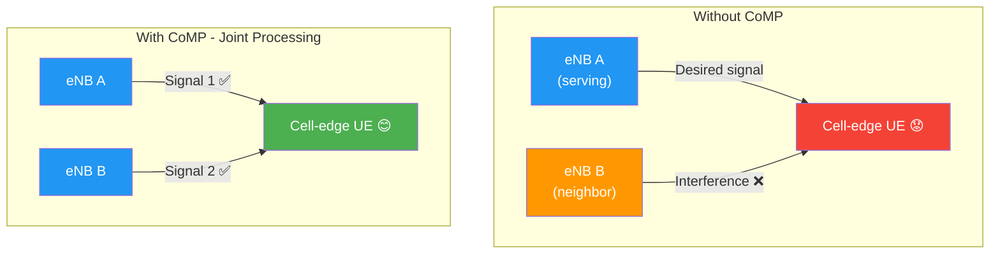

# 06 — 4G LTE-Advanced

> **Links:** [← 4G LTE](./05-4G-LTE.md) | [README](./README.md) | [5G NR →](./07-5G-NR.md)

---

## Overview

| Parameter | Value |
|---|---|
| 3GPP Release | **Release 10** |
| Initial Deployment | ~2014–2015 |
| IMT Standard | **IMT-Advanced** (first to truly meet this) |
| Max DL Speed | **1 Gbps** |
| Max UL Speed | **500 Mbps** |
| Latency | **<5 ms** |
| Spectral Efficiency | 3× LTE Rel 8 |

> **Think of it this way:** LTE (Rel 8) was marketed as "4G" but technically didn't meet IMT-Advanced targets. LTE-Advanced (Rel 10) was the first to *actually* meet the ITU's 1 Gbps requirement — making it the "true 4G."

LTE-A is **backward compatible** with LTE — an LTE device works on an LTE-A network, just without the advanced features. This was a deliberate design choice to protect operators' and users' existing investments.

---

## Key Technologies

### 1. 🎯 Carrier Aggregation (CA) ⭐ Most Important Feature

**The Problem:** Imagine you're a telecom operator. Over the years, you've won spectrum licenses in government auctions — some at 800 MHz, some at 1800 MHz, some at 2600 MHz. Each fragment might only be 10–15 MHz wide. Individually, none of them can deliver the speeds IMT-Advanced demands.

**The Solution:** Carrier Aggregation lets you *glue* these fragments together so the UE sees them as one fat pipe. It's like combining multiple lanes of traffic into a single highway — each lane (component carrier) carries part of the data, and the UE reassembles everything.

**Rules:**
- Up to **5 component carriers** (CCs) per direction
- Each CC: up to **20 MHz** bandwidth
- Total: up to **100 MHz** aggregated (5 × 20 MHz)
- CCs can be in the same band (**intra-band**) or different bands (**inter-band**)
- Can also be contiguous (adjacent) or non-contiguous (with gaps)



**Types of Carrier Aggregation:**

| Type | Description | Example | Complexity |
|---|---|---|---|
| **Intra-band Contiguous** | Multiple CCs in same band, adjacent frequencies | Two adjacent 10 MHz blocks at 1800 MHz | Easiest — similar to a single wide channel |
| **Intra-band Non-contiguous** | Same band, but with a gap between CCs | Two 10 MHz blocks at 1800 MHz with 5 MHz gap | Moderate — requires two receivers in UE |
| **Inter-band Non-contiguous** | CCs in completely different frequency bands | One CC at 800 MHz + one CC at 2600 MHz | Most complex — different propagation |

> **Why inter-band CA is powerful:** The low-band CC (e.g., 800 MHz) provides reliable coverage and reach, while the high-band CC (e.g., 2600 MHz) provides capacity and speed. You get the best of both worlds — like having a reliable car for daily commute AND a sports car for the highway.

**UE perspective:** The UE sees one wideband channel — all the complexity of managing multiple carriers is hidden by the system.

**Primary CC (PCell) vs Secondary CC (SCell):**
- One CC is always the **Primary Cell (PCell)** — handles RRC connection, NAS signaling
- Other CCs are **Secondary Cells (SCells)** — activated/deactivated dynamically based on need
- PCell is always active; SCells are added when throughput demand is high

---

### 2. Enhanced MIMO

| Feature | LTE (Rel 8) | LTE-A (Rel 10) |
|---|---|---|
| Max DL MIMO | 4×4 | Up to **8×8** |
| Max Spatial Layers DL | 4 | **8** |
| Max UL MIMO | 2×2 (Rel 9: 4×4) | Up to **4×4** |
| Beamforming | Basic | **Enhanced beamforming** |

> **Why more antennas?** Each additional antenna pair can create an independent spatial "stream" of data (like adding lanes to a highway). With 8×8 MIMO, you can theoretically send 8 independent data streams simultaneously. However, returns diminish per additional antenna — going from 2×2 to 4×4 helps a lot more than going from 6×6 to 8×8.

**Beamforming at scale:** More antennas = finer beam control = higher spatial resolution = better SINR per user. This is the seed that will grow into **Massive MIMO** in 5G.

---

### 3. 🎯 CoMP — Coordinated Multipoint

**The Problem:** Imagine you're a student sitting between two classrooms, trying to listen to your teacher. The teacher in the *other* room is talking just as loudly, and their voice interferes with yours. You can barely understand anything — this is the **cell-edge problem**.

**The Solution:** What if both teachers **coordinated**? Either they both teach you the same thing simultaneously (you hear double the signal with no interference), or one stays quiet while the other teaches. That's CoMP.



**CoMP Types:**

| Mode | How it Works | Benefit | Requirement |
|---|---|---|---|
| **Joint Processing (JP)** | Data transmitted from **multiple eNBs simultaneously** to one UE — UE combines all signals | Huge SINR improvement at cell edge; interference becomes useful signal | User data must be available at all cooperating eNBs — needs high-capacity backhaul |
| **Coordinated Scheduling / Beamforming (CS/CB)** | Only **one eNB transmits**, but others coordinate to **avoid causing interference** (e.g., scheduling silence or steering beams away) | Reduces interference without needing data at all sites | Only scheduling info shared — lower backhaul need |

**Key requirement:** Low-latency backhaul between eNBs (ideally fibre) for tight coordination. This is why CoMP works best in urban deployments with fibre-connected sites.

**Real-world impact:** CoMP can improve cell-edge throughput by **50–100%** — a massive gain for the users who need it most.

---

### 4. Relaying

**The Problem:** Coverage gaps exist in areas where deploying a full eNB (with fibre backhaul, tower, power supply) is too expensive or impractical — tunnels, rural fringes, indoor hotspots.

**The Solution:** A **Relay Node (RN)** — a lightweight intermediate node that wirelessly connects to a "donor" eNB and re-serves UEs locally.

```
Donor eNB ──[backhaul link (Un)]──▶ Relay Node ──[access link (Uu)]──▶ UE
```

| Relay Type | Own Cell ID? | Duplex Mode | Key Characteristics |
|---|---|---|---|
| **Type 1** | ✅ Yes | Inband half-duplex | Most common. UE sees RN as a separate cell. Backhaul and access share same frequency but not at the same time |
| **Type 1.a** | ✅ Yes | Outband full-duplex | Backhaul uses different frequency from access — can TX and RX simultaneously. Better performance but uses more spectrum |
| **Type 1.b** | ✅ Yes | Inband full-duplex | Same frequency for backhaul and access, simultaneous. Requires excellent antenna isolation to avoid self-interference |
| **Type 2** | ❌ No (shares donor eNB's ID) | Inband full-duplex | Transparent to UE — UE can't distinguish relay from donor eNB. Simpler but less flexible |

**Use cases:** Rural extension, tunnel/indoor coverage, temporary events, disaster recovery.

---

### 5. Device to Device (D2D) Communication

**Concept:** Direct communication between two LTE UEs **without routing through the eNB or core network** — but still using licensed LTE spectrum (unlike WiFi Direct or Bluetooth).

> **Analogy:** Normally, to talk to your coworker across the desk, your voice goes through a PA system (the network). D2D lets you just talk directly to them — faster, quieter, and works even when the PA system is broken.

**How it works:**
1. **Discovery:** UEs discover nearby D2D-capable peers (network may assist)
2. **Direct link:** Sidelink communication on dedicated resources
3. **Network role:** The network can assist with peer discovery, synchronization, resource allocation, and security — but data flows directly UE-to-UE

**Advantages over traditional cellular path:**

| Benefit | Why |
|---|---|
| Works when network is down | Disasters, emergencies — first responders can still communicate |
| Lower latency | Fewer hops = faster delivery |
| Lower power consumption | Short range, direct path |
| Higher throughput at short range | Better link budget between close devices |
| Reduced network load | Traffic doesn't traverse the network |

**Primary use case:** **Emergency services** (police, fire, ambulance) — ProSe (Proximity Services) in 3GPP.

---

## LTE-A vs LTE vs HSPA+ Performance Comparison

| Metric | HSPA+ (3G) | LTE (Rel 8) | LTE-A (Rel 10) |
|---|---|---|---|
| Max DL Speed | 28–84 Mbps | 100 Mbps | **1 Gbps** |
| Max UL Speed | 11 Mbps | 50 Mbps | **500 Mbps** |
| Latency | ~50 ms | ~10 ms | **<5 ms** |
| Cell Edge Throughput | — | Baseline | **2× LTE** |
| Average User Throughput | — | Baseline | **3× LTE** |
| Spectral Efficiency | — | Baseline | **3× LTE** |
| Multiple Access | CDMA | OFDMA/SC-FDMA | OFDMA/SC-FDMA |
| IMT Standard | IMT-2000 | Pre-IMT-Advanced | **IMT-Advanced** ✅ |

---

## LTE Pro (Rel 13+) — Bridge to 5G

Further evolution beyond LTE-A, introducing features that became seeds for 5G:

| Feature | Release | What it Does |
|---|---|---|
| **LAA (License Assisted Access)** | Rel 13 | Uses **unlicensed 5 GHz WiFi band** as secondary CC alongside licensed LTE — like borrowing a neighbor's lane when traffic is heavy |
| **NB-IoT (Narrowband IoT)** | Rel 13 | Ultra-low-power IoT devices on just **180 kHz** bandwidth (= 1 LTE PRB). Battery life: 10+ years |
| **eMTC (LTE-M)** | Rel 13 | Enhanced Machine Type Communications — 1.4 MHz bandwidth, supports voice & mobility unlike NB-IoT |
| **4×4 MIMO for small cells** | Rel 13 | Higher capacity in dense indoor/urban deployments |
| **256-QAM DL** | Rel 12 | 8 bits/symbol → higher peak throughput in good SINR conditions |

> These features are stepping stones toward 5G use cases — NB-IoT previews mMTC, LAA previews shared spectrum, and enhanced MIMO previews Massive MIMO.

---

## 🧪 Quiz

**1. How much total bandwidth can Carrier Aggregation achieve, and how?**

<details>
<summary>Show Answer</summary>

Up to **100 MHz** by aggregating up to **5 component carriers (CCs)**, each up to 20 MHz wide. CCs can be intra-band contiguous, intra-band non-contiguous, or inter-band non-contiguous. One CC serves as the Primary Cell (PCell) for control signaling, and the others are Secondary Cells (SCells) that can be dynamically activated/deactivated.
</details>

---

**2. Explain the difference between Joint Processing and Coordinated Scheduling in CoMP.**

<details>
<summary>Show Answer</summary>

- **Joint Processing (JP):** Multiple eNBs simultaneously transmit data to the cell-edge UE. The interference signal *becomes* a useful signal — the UE combines them for a massive SINR boost. Requires high-capacity, low-latency backhaul because user data must be available at all cooperating eNBs.
- **Coordinated Scheduling/Beamforming (CS/CB):** Only one eNB transmits data, but neighboring eNBs coordinate to avoid causing interference (e.g., scheduling silence or steering beams away from the UE). Lower backhaul requirement since only scheduling decisions are shared, not user data.
</details>

---

**3. Why is inter-band Carrier Aggregation more complex than intra-band contiguous CA?**

<details>
<summary>Show Answer</summary>

Inter-band CA requires the UE to have **separate RF chains (receivers and transmitters) for each frequency band**, since different bands have different propagation characteristics, antenna designs, and filter requirements. Intra-band contiguous CA can be handled almost like a single wide channel with one RF chain. However, inter-band CA is also the most *useful* type because it combines the coverage advantages of low bands with the capacity of high bands.
</details>

---

**4. What is the main challenge preventing Full Duplex relaying (Type 1.b), and how do other relay types work around it?**

<details>
<summary>Show Answer</summary>

The main challenge is **self-interference** — when a relay transmits and receives on the same frequency simultaneously, its own transmitted signal (which is much stronger) overwhelms the received signal. Type 1 avoids this by using **half-duplex** (transmit and receive at different times). Type 1.a avoids it by using **different frequencies** for backhaul and access (outband). Type 1.b requires advanced **antenna isolation techniques** to suppress self-interference, making it the most technically challenging.
</details>

---

**5. Why was LTE-A considered the first "true 4G," and what is the difference between IMT-Advanced and the earlier IMT-2000?**

<details>
<summary>Show Answer</summary>

The ITU defined **IMT-Advanced** as the standard for "true 4G," requiring peak data rates of **1 Gbps** (low mobility) and **100 Mbps** (high mobility). LTE Rel 8 achieved only 100 Mbps peak DL, which fell short — it was technically **pre-IMT-Advanced** (the ITU later allowed it to be marketed as 4G due to significant improvement over 3G). LTE-Advanced (Rel 10) met the full 1 Gbps requirement through Carrier Aggregation, enhanced MIMO, and CoMP. **IMT-2000** was the 3G standard (2 Mbps), while **IMT-Advanced** was the 4G standard.
</details>

---

> **Next:** [07 — 5G NR →](./07-5G-NR.md)
