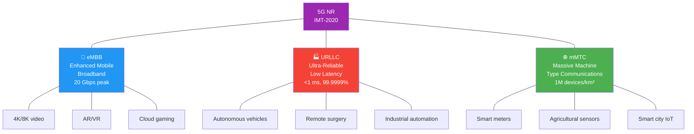
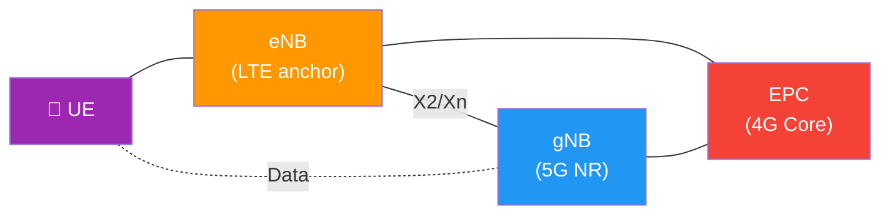
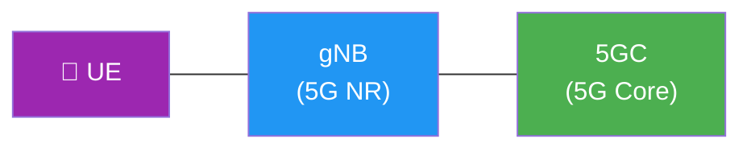
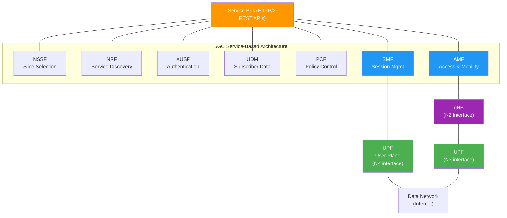
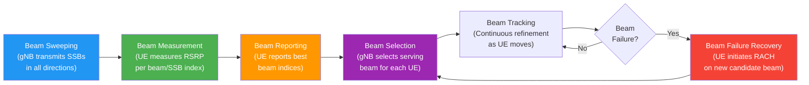
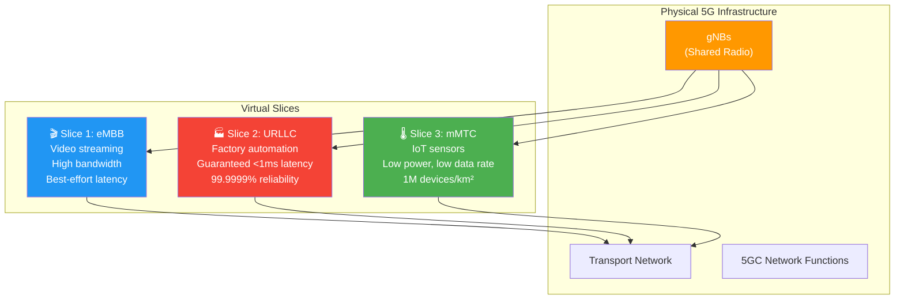

# 07 — 5G NR (New Radio)

> **Links:** [← LTE Advanced](./06-4G-LTE-Advanced.md) | [README](./README.md) | [6G →](./08-6G.md)

---

## Overview

| Parameter | Value |
|---|---|
| Full Name | 5G New Radio |
| Standard Body | 3GPP |
| First Deployment | 2018–2019 |
| 3GPP Release | Rel 15 (Phase 1), Rel 16 (Phase 2) |
| Peak DL Speed | **20 Gbps** |
| Peak UL Speed | **10 Gbps** |
| Real-World DL | ~100 Mbps – 1 Gbps per user |
| Latency Target | **4 ms** (URLLC: **<1 ms**) |
| Connection Density | **1 million devices/km²** |
| Mobility | Up to 500 km/h |
| Spectrum Efficiency | 3× improvement over LTE |

> **Key philosophy shift:** Every previous generation was *technology-push* — "we invented this, let's find uses for it." 5G flipped this to *use-case-pull* — "here are three very different things society needs; let's design a system flexible enough to serve all of them simultaneously."

---

## 🎯 Three Use Cases — IMT-2020 (ITU Definition)

| Use Case | Full Name | Primary Target | Key Metric | Examples |
|---|---|---|---|---|
| **eMBB** | Enhanced Mobile Broadband | High data rate | **20 Gbps** peak DL | 4K/8K streaming, AR/VR, cloud gaming |
| **URLLC** | Ultra-Reliable Low Latency Comm. | Ultra-low latency + reliability | **<1 ms** latency, **99.9999%** reliability | Autonomous driving, remote surgery, factory automation |
| **mMTC** | Massive Machine Type Comm. | Massive device density | **1 million devices/km²** | IoT sensors, smart meters, precision agriculture |

> **Why this matters:** Each use case has *contradictory* requirements. eMBB wants speed (doesn't care much about latency). URLLC wants guaranteed low latency (doesn't need huge bandwidth). mMTC wants battery life and density (doesn't need speed). 5G's genius is serving ALL three on one physical network using **flexible numerology** and **network slicing**.

---

## 🎯 NSA vs SA — Deployment Modes

This is one of the most commonly asked 5G questions in interviews. Understanding WHY two modes exist reveals the economic reality of telecom.

### NSA — Non-Standalone (Option 3x)

- 5G NR **radio** + **4G LTE core** (EPC)
- LTE eNB is the "anchor" — handles control plane (RRC, NAS)
- 5G gNB is "secondary" — provides high-speed data pipe
- **Why NSA first?** Operators spent billions building LTE cores. NSA lets them launch "5G" service quickly by adding gNBs while reusing the entire EPC investment. Pragmatic, not elegant.

**NSA Limitations:**
- No true network slicing (EPC doesn't support it)
- No URLLC guarantees (EPC wasn't designed for <1 ms)
- Control plane still goes through LTE — adds latency
- Dual connectivity increases UE power consumption

### SA — Standalone (Option 2)

- 5G NR radio + **5G Core (5GC)** — fully independent of LTE
- gNB connects directly to 5GC
- Supports ALL 5G features: network slicing, URLLC, SBA
- **Target architecture** — but requires full 5GC deployment (expensive, complex)

| Aspect | NSA (Option 3x) | SA (Option 2) |
|---|---|---|
| Core Network | 4G EPC | **5GC** |
| Control Plane Anchor | LTE eNB | **gNB** |
| Network Slicing | ❌ | ✅ |
| URLLC | Limited | **Full** |
| Deployment Cost | Lower (reuse EPC) | Higher (new 5GC) |
| Industry Status | Most current deployments | Gradually rolling out |

---

## 🎯 5G Core (5GC) — Service-Based Architecture

The 5GC is a **radical redesign** from 4G's EPC. Instead of monolithic network elements connected by point-to-point interfaces, 5GC uses a **Service-Based Architecture (SBA)** — network functions expose APIs (HTTP/2 REST) and discover each other dynamically.

> **Analogy:** 4G EPC was like a traditional company with fixed departments and dedicated phone lines between them. 5GC is like a modern microservices platform — each service publishes its APIs, and others call them as needed. You can scale, upgrade, or replace any service independently.

### Key 5GC Network Functions

| NF | Full Name | 4G Equivalent | Role | Key Detail |
|---|---|---|---|---|
| **AMF** | Access and Mobility Management Function | MME | NAS signaling, registration, mobility, authentication coordination | Entry point for all UE signaling |
| **SMF** | Session Management Function | P-GW (CP) | PDU session setup, IP allocation, QoS flow management | Selects and controls UPF |
| **UPF** | User Plane Function | P-GW (UP) + S-GW | Packet forwarding, QoS enforcement, traffic measurement | Only NF that touches user data |
| **UDM** | Unified Data Management | HSS | Subscriber profiles, subscription data | Backed by UDR (data repository) |
| **AUSF** | Authentication Server Function | AuC | 5G-AKA authentication | Stronger security than 4G |
| **PCF** | Policy Control Function | PCRF | Policy rules, QoS decisions, charging | Drives network behavior |
| **NRF** | Network Repository Function | *New in 5G* | Service discovery — NFs register and discover each other | Heart of SBA model |
| **NSSF** | Network Slice Selection Function | *New in 5G* | Selects appropriate network slice for a UE | Enables multi-slice operation |

> **🎯 Interview tip:** Know the 4G equivalents cold. "What replaced the MME in 5G?" → "The AMF handles mobility and signaling, while session management was split out to the SMF — a cleaner separation of concerns."

---

## 5G NR Radio — Air Interface

### 🎯 Frequency Bands

| Range | Name | Frequencies | Bandwidth | Coverage | Penetration | Deployment |
|---|---|---|---|---|---|---|
| **FR1** | Sub-6 GHz | 450 MHz – 7.125 GHz | Up to 100 MHz per CC | Good | Moderate to good | Most initial deployments |
| **FR2** | mmWave | 24.25 GHz – 52.6 GHz | Up to 400 MHz per CC | Short (few hundred meters) | Poor (blocked by walls, rain) | Dense urban, stadiums, venues |

> **Why mmWave matters despite its problems:** At 28 GHz, there's **enormous bandwidth available** (hundreds of MHz contiguous) — something impossible in crowded sub-6 GHz bands. The tradeoff is severe: high path loss, blocked by walls, rain attenuation. The solution? **Massive MIMO + beamforming** to focus energy, plus **dense small cells**.

**mmWave challenge summary:**
- ✅ Huge bandwidth → very high speeds (multi-Gbps)
- ❌ High free-space path loss (proportional to f²)
- ❌ Cannot penetrate buildings, foliage, even human bodies
- ❌ Rain attenuation at higher mmWave frequencies
- ❌ Requires dense deployment (small cells every 100–200m)

---

### 🎯 Numerology — Flexible Subcarrier Spacing

This is a **fundamental 5G NR innovation.** LTE had a fixed 15 kHz subcarrier spacing — one size fits all. 5G NR supports multiple numerologies because different use cases need different trade-offs between **latency** and **robustness**.

| μ (mu) | Subcarrier Spacing (SCS) | Slot Duration | Symbols/Slot | CP Length | Primary Use Case | Band |
|---|---|---|---|---|---|---|
| 0 | 15 kHz | 1 ms | 14 | Normal | LTE compatibility, FR1 | FR1 |
| 1 | 30 kHz | 0.5 ms | 14 | Normal | **Most common FR1 5G** | FR1 |
| 2 | 60 kHz | 0.25 ms | 14 | Normal/Extended | FR1/FR2 transition | FR1/FR2 |
| 3 | 120 kHz | 0.125 ms | 14 | Normal | **mmWave (FR2)** | FR2 |
| 4 | 240 kHz | 0.0625 ms | 14 | Normal | SSB reference only | FR2 |

**The math:** SCS = 15 × 2^μ kHz. Slot duration = 1/2^μ ms.

> **Why does wider SCS = lower latency?** A slot is the minimum scheduling unit. At μ=0, one slot = 1 ms. At μ=3, one slot = 0.125 ms = 125 μs. URLLC can be scheduled in a single slot → the shorter the slot, the less time you wait. But wider SCS also means shorter symbol duration → more susceptible to timing errors and shorter CP → only works at high frequencies where delay spread is small (indoor/LOS environments).

**Mini-slot scheduling:** For URLLC, 5G NR can also schedule data on **mini-slots** (2, 4, or 7 symbols instead of a full 14-symbol slot) — cutting latency even further.

---

## 🎯 Massive MIMO and Beamforming

### Massive MIMO

| Aspect | 4G LTE | 5G NR |
|---|---|---|
| Antenna configuration | Typically 2T2R or 4T4R, max 8T8R | **32T32R, 64T64R**, or more |
| Spatial layers (DL) | Max 8 (LTE-A) | Up to **16** |
| Antenna elements | ~4–8 | **64–256+** |

> **Why do more antennas help?** Think of it like spotlights in a theater. With 4 spotlights, you can illuminate 4 actors simultaneously but the beams are wide and spill over. With 64 spotlights, you can create razor-sharp beams for each actor (user), with almost no light wasted. Each beam = an independent spatial stream. More beams = more simultaneous users at full speed = higher cell capacity.

**Massive MIMO benefits:**
1. **More spatial streams** → serve more users simultaneously (MU-MIMO)
2. **Higher beamforming gain** → stronger signal at each UE → higher SINR → higher MCS → more throughput
3. **Better interference management** → narrow beams mean less interference to other users
4. **Higher energy efficiency** → focused energy instead of broadcasting everywhere

---

### Beamforming — Explained Intuitively

> **Room light vs. flashlight:** Traditional cellular is like a room light — it illuminates everything equally (omnidirectional). Beamforming is like a flashlight — it concentrates energy in one direction. With 64 antenna elements, you have a flashlight so precise you can aim it at individual users.

**Types of beamforming:**
- **Analog beamforming:** Phase shifters steer one beam. Simple but only one beam direction at a time.
- **Digital beamforming:** Each antenna element has its own RF chain. Can form multiple independent beams simultaneously. More expensive but far more capable.
- **Hybrid beamforming:** Combination — digital beamforming across antenna panels, analog beamforming within each panel. The practical 5G approach.
- **3D beamforming:** Beams steered both **horizontally** (azimuth) and **vertically** (elevation). Important for high-rise buildings — serve users on different floors with different vertical beams.

---

### Beam Management — New in 5G NR

LTE didn't need beam management because antennas covered the whole cell with wide beams. With narrow 5G beams, the network must constantly track where each UE is and adjust beams accordingly.

**Beam failure recovery** is critical — if a beam is suddenly blocked (e.g., UE turns a corner, a truck passes), the UE must rapidly switch to another beam. The procedure is similar to a RACH process on a new candidate beam.

---

## 🎯 Network Slicing

**Concept:** Divide one physical 5G network into multiple **isolated virtual networks**, each customized and optimized for a specific use case or customer.

> **Analogy:** Think of a highway with 6 lanes. Without slicing, all traffic shares all lanes — a massive convoy of trucks slows down ambulances. With slicing, you dedicate 2 lanes exclusively for emergency vehicles (URLLC), 3 lanes for regular traffic (eMBB), and 1 lane for slow-moving farm vehicles (mMTC). Each "slice" gets guaranteed resources and can't be affected by congestion in other slices.

**Each slice has:**
- Its own **QoS parameters** (latency, bandwidth, reliability guarantees)
- **Resource isolation** (one slice's congestion doesn't affect others)
- **Independent lifecycle management** (deploy, scale, tear down independently)
- **Potentially different network functions** (a mMTC slice may not need a full AMF)

**Enabled by:** NFV (Network Function Virtualization) + SDN (Software Defined Networking) + the NSSF (Network Slice Selection Function) in 5GC.

**Business model:** Operators can sell customized slices to enterprise customers — a car manufacturer buys a URLLC slice; a video streaming company buys an eMBB slice. Each pays for what they need.

---

## 5G NR Physical Channels

### Downlink Channels

| Channel | Full Name | Purpose | Key Details |
|---|---|---|---|
| **PDSCH** | Physical Downlink Shared Channel | User data + system info (SIBs) | Main data-carrying channel; supports up to 256-QAM |
| **PDCCH** | Physical Downlink Control Channel | DCI (scheduling grants, power control) | QPSK only + Polar coding; uses CORESETs (configurable) |
| **PBCH** | Physical Broadcast Channel | MIB (Master Information Block) | Part of SSB; always QPSK; 80 ms periodicity |

### Uplink Channels

| Channel | Full Name | Purpose | Key Details |
|---|---|---|---|
| **PUSCH** | Physical Uplink Shared Channel | User data + UCI | Supports transform precoding (like SC-FDMA) for coverage |
| **PUCCH** | Physical Uplink Control Channel | UCI: HARQ-ACK, SR, CSI | 5 formats (short/long) for flexibility |
| **PRACH** | Physical Random Access Channel | Initial access, HO, beam recovery | Long/short preamble formats |

**Removed from 5G (existed in LTE):** PHICH (HARQ indicator), PCFICH (control format indicator) — 5G NR makes HARQ feedback and control region sizing more flexible through DCI and CORESET configuration.

---

### SSB — Synchronization Signal Block 🎯

A **new concept in 5G NR** that replaces LTE's always-on Cell-Specific Reference Signals (CRS).

**SSB contains:**
- **PSS** (Primary Synchronization Signal) — timing synchronization
- **SSS** (Secondary Synchronization Signal) — cell ID detection
- **PBCH** (+ DMRS) — carries MIB (Master Information Block)

**Why SSB is different from LTE CRS:**
- In LTE, CRS was transmitted **continuously across the entire bandwidth** — always on, always consuming power
- In 5G NR, SSB is transmitted in **periodic bursts** within **specific beams** — much more energy efficient
- UE measures **SSB RSRP per beam index** → selects the best beam → reports to gNB

**SSB Burst Set:**
- Default periodicity: **20 ms**
- Number of SSB beams: up to 4 (FR1), up to 64 (FR2)
- Each SSB occupies 4 OFDM symbols × 240 subcarriers (= 20 RBs)

> **Why more SSBs in FR2?** mmWave beams are very narrow, so the gNB needs more beams to cover the full cell. It sweeps through up to 64 beam directions during one SSB burst, like a lighthouse sweeping its beam.

---

## VoNR — Voice over New Radio

Voice over 5G — the equivalent of VoLTE for 4G.

| Aspect | VoLTE (4G) | VoNR (5G) |
|---|---|---|
| Radio | LTE | 5G NR |
| Core | EPC | 5GC |
| Session Control | IMS | IMS (same framework) |
| Latency | ~10 ms radio | **<4 ms** radio |
| Codec | EVS/AMR-WB | EVS/AMR-WB |
| Simultaneous data | Yes, but shared capacity | Yes, with much higher capacity |

**VoNR requires:** 5G NR (SA mode) + 5GC + IMS integration

**In early deployments (NSA):** Voice falls back to **VoLTE** (EPS Fallback) or even 3G CS voice — because NSA doesn't have a 5G core to host IMS sessions.

**VoNR advantages over VoLTE:**
- Lower latency → more natural conversations
- Can run alongside high-speed data (5G capacity is much higher)
- Foundation for immersive communication (AR/VR calls)
- Better voice quality in challenging RF conditions (beamforming helps)

---

## 3GPP Release Timeline for 5G

| Release | Freeze Date | Codename | Key Content |
|---|---|---|---|
| Rel 14 | Mid 2017 | — | Road to 5G: LTE enhancements, V2X study |
| **Rel 15** | End 2018 | **5G Phase 1** | NSA + SA, basic 5G NR, 5GC SBA |
| **Rel 16** | July 2020 | **5G Phase 2** | URLLC enhancements, V2X (NR), IAB (Integrated Access & Backhaul), NR-U (unlicensed) |
| **Rel 17** | March 2022 | — | NR-Light (RedCap), NTN (satellite), 52.6–71 GHz, multicast |
| **Rel 18** | March 2024 | **5G-Advanced** | AI/ML for NR, XR enhancements, network energy savings |
| Rel 19 | ~2025 | 5G-Advanced Ph2 | Further AI/ML, ambient IoT, duplex evolution |

---

## 5G vs 4G LTE — Comprehensive Comparison 🎯

| Feature | 4G LTE / LTE-A | 5G NR |
|---|---|---|
| Peak DL Speed | 100 Mbps / 1 Gbps | **20 Gbps** |
| Peak UL Speed | 50 Mbps / 500 Mbps | **10 Gbps** |
| Latency | ~10 ms / <5 ms | **<4 ms** (URLLC: **<1 ms**) |
| Connection Density | ~100K/km² | **1 million/km²** |
| Base Station | eNodeB (eNB) | gNodeB (gNB) |
| Core Network | EPC (point-to-point) | **5GC (SBA — microservices)** |
| Spectrum | Sub-6 GHz only | Sub-6 GHz + **mmWave (FR2)** |
| Subcarrier Spacing | Fixed 15 kHz | **Flexible: 15–240 kHz** |
| MIMO | Max 8T8R (LTE-A) | **Massive MIMO (64T64R+)** |
| Network Slicing | Not supported | **Native support** |
| Channel Coding | Turbo codes | **LDPC (data) + Polar (control)** |
| Use Case Focus | Mobile broadband | **eMBB + URLLC + mMTC** |
| Reference Signals | CRS (always-on) | **SSB + DMRS (on-demand)** |
| Duplex | FDD or TDD | FDD, TDD, **dynamic TDD** |
| Carrier Aggregation | Up to 5 CCs (100 MHz) | Up to 16 CCs (FR1: 1 GHz) |
| Architecture | Distributed (eNB = RAN) | **Split architecture (CU/DU/RU)** |

---

## 🧪 Quiz

**1. Name the three 5G use cases and give one example for each.**

Show Answer

1. **eMBB** (Enhanced Mobile Broadband) — 4K/8K streaming, AR/VR, cloud gaming. Target: 20 Gbps peak.
2. **URLLC** (Ultra-Reliable Low Latency Communications) — autonomous vehicles, remote surgery, factory automation. Target: <1 ms latency, 99.9999% reliability.
3. **mMTC** (Massive Machine Type Communications) — IoT sensors, smart meters, agricultural monitoring. Target: 1 million devices/km².

---

**2. 🎯 Explain the difference between NSA and SA 5G deployment. Why did operators deploy NSA first?**

Show Answer

- **NSA (Non-Standalone):** 5G NR radio is used alongside an existing **4G LTE core (EPC)**. The LTE eNB acts as the control-plane anchor, and the 5G gNB acts as a secondary node for high-speed data. It cannot support full 5G features like network slicing or URLLC.
- **SA (Standalone):** 5G NR radio connects to a **5G Core (5GC)** — completely independent of LTE. Supports all 5G features including network slicing, URLLC, and SBA.
- **Why NSA first?** Operators had already invested billions in LTE core infrastructure. NSA let them launch 5G service quickly by simply adding gNBs to the existing network. SA requires building an entirely new 5GC — much more expensive and complex.

---

**3. What is the role of the NRF in 5GC, and why doesn't 4G have an equivalent?**

Show Answer

The **NRF (Network Repository Function)** is the service discovery engine of 5GC. Network functions register their capabilities with the NRF, and other NFs query the NRF to discover and connect to services they need. 4G EPC didn't need an NRF because it used **fixed point-to-point interfaces** (S1, S5, S6a, etc.) — every element knew exactly where to connect. 5GC's **Service-Based Architecture** is dynamic and requires a registry for NFs to find each other, just like microservices need a service mesh/registry.

---

**4. 🎯 Why does 5G NR use flexible numerology (multiple subcarrier spacings)? Give an example.**

Show Answer

Different use cases have different latency and robustness requirements:
- **URLLC** needs very low latency → use μ=3 (120 kHz SCS) → slot duration = 0.125 ms → data can be scheduled and transmitted in just 125 μs.
- **eMBB on FR1** uses μ=1 (30 kHz SCS) → slot duration = 0.5 ms → good balance of latency and robustness.
- Wider SCS = shorter symbol duration = shorter cyclic prefix → more susceptible to multipath (delay spread). So narrow SCS works better in low-frequency, high-delay-spread environments, while wide SCS works in high-frequency, low-delay-spread environments (mmWave, indoor).

LTE's fixed 15 kHz couldn't serve all three use cases optimally — 5G NR's flexibility is a core design innovation.

---

**5. Explain Massive MIMO using an analogy. Why does it increase capacity?**

Show Answer

**Analogy:** Traditional MIMO (4×4) is like having 4 spotlights in a theater — you can illuminate 4 actors at once, but the beams are wide and overlap. Massive MIMO (64T64R) is like having 64 spotlights — each beam is razor-sharp, aimed precisely at individual actors (users). No wasted light (energy), no spill onto other actors (interference).

**Why it increases capacity:**
1. **More spatial streams** — serve 16+ users simultaneously (MU-MIMO)
2. **Higher beamforming gain** — concentrated energy → better SINR → higher MCS → more throughput per user
3. **Less inter-user interference** — narrow beams don't interfere with each other
4. **Cell-edge improvement** — beamforming gain helps overcome path loss at cell edge

---

**6. What is network slicing and what enables it?**

Show Answer

**Network slicing** divides one physical 5G network into multiple isolated virtual networks (slices), each customized for a specific use case or customer. For example:
- Slice 1 (eMBB): High bandwidth for video streaming
- Slice 2 (URLLC): Guaranteed <1 ms latency for factory automation
- Slice 3 (mMTC): Low power, massive connections for IoT

Each slice has its own QoS guarantees, resource isolation, and independent management.

**Enabled by:** NFV (Network Function Virtualization) to create virtual NFs, SDN (Software Defined Networking) to program the transport, and the **NSSF** (Network Slice Selection Function) in 5GC to assign UEs to appropriate slices.

---

**7. What is an SSB in 5G NR, and how does it differ from LTE's CRS?**

Show Answer

**SSB (Synchronization Signal Block)** contains PSS + SSS + PBCH and is used for cell synchronization, cell ID detection, and initial system information. Key differences from LTE CRS:
- **LTE CRS** was transmitted **continuously** across the entire bandwidth — always consuming power and resources.
- **5G SSB** is transmitted in **periodic bursts** (default 20 ms) within **specific beam directions** — much more energy efficient.
- In mmWave (FR2), up to **64 SSBs** are transmitted per burst to sweep all beam directions (like a lighthouse).
- UE measures **SSB RSRP per beam index** to select the best serving beam — this is the foundation of beam management.

---

**8. In 5G NR, what channels were removed compared to LTE, and why?**

Show Answer

**Removed channels:**
- **PHICH** (Physical HARQ Indicator Channel) — In LTE, PHICH explicitly signaled HARQ ACK/NACK for each UL transmission. In 5G NR, HARQ feedback is more flexible and can be carried in DCI on PDCCH.
- **PCFICH** (Physical Control Format Indicator Channel) — In LTE, PCFICH told the UE how many OFDM symbols were used for the control region. In 5G NR, the control region uses **CORESETs** (Control Resource Sets) which are configured via RRC, not dynamically signaled each subframe.

The removal reflects 5G NR's philosophy of **flexibility** — configure once via higher-layer signaling instead of wasting resources signaling every subframe.

---

> **Next:** [08 — 6G →](./08-6G.md)
