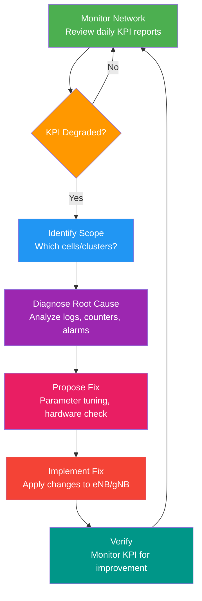

# 09 — KPIs & Network Optimization

> **Links:** [← 6G](./08-6G.md) | [README](./README.md) | [Quick Reference →](./10-quick-reference.md)

---

## Why KPIs Matter for NDO

An NDO (Network Design and Optimization) engineer's primary job revolves around KPIs (Key Performance Indicators). You are essentially the "doctor" for the network, constantly monitoring its vital signs, diagnosing issues, and prescribing fixes.

### The Daily NDO Workflow



---

## Core KPIs

### 1. RSRP — Reference Signal Received Power

| Attribute | Detail |
|---|---|
| What it measures | **Signal strength** — power of LTE reference signal at UE |
| Unit | dBm |
| Good | > -80 dBm (excellent) |
| Acceptable | -80 to -100 dBm |
| Poor | < -100 dBm |
| Critical | < -110 dBm (coverage hole) |

**What RSRP tells you:** Whether the UE can physically receive the signal. Low RSRP = coverage problem.

**Root causes of low RSRP:**
- UE too far from base station (coverage hole)
- Physical obstruction (building, terrain)
- Antenna tilt too aggressive
- Antenna failure or feeder loss

**Fix:** Increase antenna height, reduce electrical/mechanical tilt (up-tilt), add new cell site, increase transmit power.

---

### 2. RSRQ — Reference Signal Received Quality

| Attribute | Detail |
|---|---|
| What it measures | **Signal quality** accounting for interference from other cells |
| Formula | RSRQ = N × RSRP / RSSI (N = number of RBs) |
| Unit | dB |
| Good | > -10 dB |
| Acceptable | -10 to -15 dB |
| Poor | < -15 dB |

**RSRP vs RSRQ:** You can have good RSRP (strong signal) but bad RSRQ (strong signal + even stronger interference from a neighboring cell). Think of it like someone talking loudly in a crowded room (good RSRP) but you still can't understand them because everyone else is also shouting (bad RSRQ).

**Root causes of poor RSRQ:**
- High interference from neighboring cells (co-channel interference)
- Pilot pollution (too many cells visible at the same time with similar strength)
- High cell load

**Fix:** Adjust frequency plan, modify neighbor list, down-tilt antennas to contain overshooting coverage, increase PCI (Physical Cell Identity) reuse distance.

---

### 3. SINR — Signal to Interference and Noise Ratio

| Attribute | Detail |
|---|---|
| What it measures | **Link quality** — how much stronger the signal is compared to interference + noise |
| Unit | dB |
| Excellent | > 20 dB (256-QAM possible) |
| Good | 10–20 dB |
| Acceptable | 0–10 dB (QPSK to 16-QAM range) |
| Poor | < 0 dB (QPSK with heavy coding) |

**Why SINR is critical:** It directly determines the **Modulation and Coding Scheme (MCS)**. High SINR = 64-QAM or 256-QAM (high throughput). Low SINR = QPSK (low throughput). It also determines if HARQ retransmissions are needed, impacting latency.

---

### 4. 🎯 CSSR — Call Setup Success Rate

| Attribute | Detail |
|---|---|
| What it measures | % of call/session setup attempts that succeed |
| Formula | Successful setups / Total setup attempts × 100% |
| Target (SLA) | **> 99%** |
| Warning | < 98% |
| Critical | < 95% |

**Root causes of low CSSR:**
- RACH congestion (too many UEs trying to access simultaneously)
- Signaling channel congestion (PDCCH, PUCCH)
- Backhaul congestion
- Hardware fault at eNB
- Coverage hole causing failed RRC setup

**Diagnosis steps:**
1. Check RACH success rate separately (is the problem at the very first step?).
2. Check RRC setup success rate.
3. Check S1 (eNB to MME) link quality.
4. Check hardware alarms on the specific cell.
5. Correlate with time of day (peak hour issue → congestion; all hours → hardware/coverage fault).

---

### 5. CDR — Call Drop Rate

| Attribute | Detail |
|---|---|
| What it measures | % of successfully connected calls/sessions that drop before intended completion |
| Formula | Dropped calls / (Successful setups + Incoming handovers) × 100% |
| Target | **< 0.5%** |
| Warning | > 1% |
| Critical | > 2% |

**Root causes:**
- Coverage hole during mobility (handover too late, signal drops out)
- Failed handover (X2 link down, target cell congested)
- Rapid signal drop (fast-moving UE rounding a corner)
- RLF (Radio Link Failure) — SINR drops below threshold with no handover alternative

**Diagnosis:**
1. Check handover success rate (if HOSR is low → check X2 links and neighbor lists).
2. Check coverage maps (are drops clustered in a specific geographic area?).
3. Check if drops correlate with UE speed (e.g., along a highway).

---

### 6. HOSR — Handover Success Rate

| Attribute | Detail |
|---|---|
| What it measures | % of handover attempts that complete successfully |
| Target | **> 98%** |
| Warning | < 95% |

**Root causes of low HOSR:**
- Target cell doesn't respond (hardware fault, backhaul issue)
- Too-late handover (UE signal already too low by time HO executes)
- Too-early handover (UE handed to a cell that's too weak → ping-pong → HO failure)
- Missing neighbor relation (cell not in neighbor list → UE can't be handed to best cell)
- X2 interface failure

---

### 7. PRB Utilization — Physical Resource Block Utilization

| Attribute | Detail |
|---|---|
| What it measures | % of resource blocks in use out of total available |
| Unit | % |
| Normal | <70% |
| High | 70–85% — monitor closely |
| Congested | **>85%** — action needed |

**Why it matters:** When PRB utilization is consistently high, the cell is congested. New users can't get resources, resulting in poor throughput and high latency for everyone.

**Fix:** Add capacity (deploy carrier aggregation, add a new cell site, deploy small cells), offload traffic to WiFi, optimize scheduler settings.

---

### 8. Throughput

| Metric | Typical Benchmark |
|---|---|
| Cell average DL throughput | Varies heavily by band/BW — compare against design target |
| Cell edge throughput (5th percentile) | Should be >25% of cell average |
| Peak throughput per UE | Depends on MIMO config, CA, and bandwidth |

**Throughput degradation diagnosis:**
1. Low SINR → UE forced to use low MCS (QPSK) → low throughput.
2. High PRB utilization → congestion → UE gets fewer resource blocks.
3. MIMO rank reduction → signal conditions don't support multiple spatial streams (fallback to diversity or SISO).
4. High HARQ retransmission rate → effective throughput drops.

---

## SON — Self-Organizing Network Features

SON automates many NDO tasks, reducing manual parameter tuning.

| Feature | Full Name | What it does |
|---|---|---|
| **ANR** | Automatic Neighbour Relation | eNB automatically detects missing neighbors via UE measurement reports and adds them to the neighbor list. |
| **MLB** | Mobility Load Balancing | Shifts UEs from overloaded cells to lightly loaded adjacent cells by tweaking handover thresholds. |
| **MRO** | Mobility Robustness Optimization | Automatically fixes handover problems (adjusts A3 offsets to fix too-early, too-late, or wrong-cell handovers). |
| **CCO** | Coverage & Capacity Optimization | Automatically adjusts transmit power and antenna tilts based on traffic patterns. |

---

## Link Budget and Path Loss

### Typical LTE Link Budget Example

```text
Tx Power (eNB):      46 dBm
Antenna Gain:        +18 dBi
Feeder Loss:         -2 dB
EIRP:                62 dBm
Path Loss:           -[depends on range]
Penetration Loss:    -20 dB (indoor)
Rx Antenna Gain:     0 dBi (UE)
Noise Figure (UE):   -9 dB
Rx Sensitivity:      -100 dBm

Max Allowable Path Loss = 62 + 0 - 20 - (-100) - 9 = 133 dB
```

### Path Loss Models

| Model | Applicable Range / Environment |
|---|---|
| **Free Space** | Open space, pure Line-of-Sight (LOS) |
| **Okumura-Hata** | Complex formula, 150–1500 MHz (Urban/Suburban) |
| **COST-231-Hata** | Extended Hata for 1.5–2 GHz (Urban) |

*Note: Higher frequencies experience much higher path loss, resulting in a smaller cell radius for the same transmit power.*

---

## 🎯 NDO Diagnostic Framework

When presented with a KPI problem in an interview, use this systematic approach:

1. **SCOPE:** Which cells are affected? Is it one sector, a whole site, or a cluster of sites? Is there a geographic pattern?
2. **TIME:** When did it start? Is it constant or intermittent? Does it correlate with peak traffic hours?
3. **CORRELATE:** Are other KPIs affected? (e.g., low CSSR + high PRB = congestion). Are there hardware alarms? Were there recent network changes?
4. **ISOLATE:** Determine the domain: Hardware fault? Coverage hole? Congestion? Configuration/parameter error? External interference?
5. **FIX:** Propose the solution: Parameter change (tilt, thresholds), hardware repair, config update.
6. **VERIFY:** Did the KPI recover after the fix? Did the fix cause any side effects on adjacent cells?

---

## 🧪 Self-Test Quiz

**1. A cell shows excellent RSRP (-75 dBm) but terrible RSRQ (-18 dB). What is the most likely issue?**
<details>
<summary>Show Answer</summary>

**High interference / Pilot Pollution.** The UE is receiving a strong signal from the serving cell (good RSRP), but it is also receiving very strong signals from neighboring cells using the same frequencies, causing the quality (RSRQ) to tank. The solution would involve down-tilting the antennas to contain coverage or optimizing the frequency/PCI plan.
</details>

**2. A specific cell drops calls (High CDR) exactly at 5:00 PM every weekday, accompanied by PRB utilization hitting 95%. What is the diagnosis and fix?**
<details>
<summary>Show Answer</summary>

**Diagnosis: Congestion.** The issue correlates with rush hour (time-based) and shows maxed out resource blocks. Calls are dropping because the eNB literally cannot allocate enough resources to keep connections alive.
**Fix:** Short-term: enable Load Balancing (MLB) to push users to adjacent cells. Long-term: add capacity via Carrier Aggregation, deploy a small cell in that specific area, or add more spectrum.
</details>

**3. What is the difference between MLB and MRO in SON?**
<details>
<summary>Show Answer</summary>

- **MLB (Mobility Load Balancing)** moves active users from a congested cell to a lightly-loaded neighbor by intentionally triggering handovers earlier than usual. It's about distributing traffic.
- **MRO (Mobility Robustness Optimization)** fixes broken handovers. If a UE is dropping calls because handovers are happening too late or too early, MRO automatically adjusts the A3 event thresholds to fix the timing.
</details>

**4. A UE reports an SINR of 3 dB. What Modulation and Coding Scheme (MCS) will the eNodeB likely assign?**
<details>
<summary>Show Answer</summary>

**QPSK.** 3 dB is a relatively poor SINR. The eNodeB will assign a robust, low-order modulation scheme like QPSK with heavy error coding to ensure the data makes it through the noisy channel. It will not use 16-QAM or 64-QAM.
</details>

**5. You notice a cell has a Call Setup Success Rate (CSSR) of 85% (Critical). You check the logs and see the RACH success rate is 99%, but RRC Connection setups are failing. What does this tell you?**
<details>
<summary>Show Answer</summary>

It tells you the issue is **not an RF coverage or initial access problem**. The UE is successfully reaching the eNB via the Random Access Channel (RACH). The failure happens later in the signaling process (RRC connection setup). This points towards signaling channel congestion (PDCCH), an eNB processing issue, or a failure in the backhaul/S1 link to the MME.
</details>

**6. If you physically tilt a cell tower antenna downwards by 3 degrees (mechanical tilt), how does this affect RSRP and RSRQ for users at the cell edge?**
<details>
<summary>Show Answer</summary>

- **RSRP for cell-edge users will drop**, because the main lobe of the antenna is now pointing closer to the tower, reducing signal strength at the edge.
- **RSRQ for users in the *neighboring* cell will improve**, because you have reduced the interference spilling over into their area.
</details>

---

> **Next:** [10 — Quick Reference →](./10-quick-reference.md)
