# 📡 Telecom Notes

> **Atomic notes on cellular technology from 2G to 6G.**  
> Every file stands alone but links to related notes.  
> ✅ Mermaid diagrams for architecture visualization  
> ✅ Intuitive analogies for complex concepts  
> ✅ Quiz sections for self-testing  
> Start here → follow links → use Quick Reference for revision.

---

## 📂 Contents

| # | File | What's Inside |
|---|---|---|
| 00 | [Fundamentals](./00-fundamentals.md) | Cells, frequency reuse, multiple access, modulation, link budget |
| 01 | [2G GSM](./01-2G-GSM.md) | Architecture, channels, handover, SIM, MAHO |
| 02 | [2G GPRS & EDGE](./02-2G-GPRS-EDGE.md) | Packet data, SGSN/GGSN, 8PSK, MCS schemes |
| 03 | [3G UMTS](./03-3G-UMTS.md) | WCDMA, CDMA basics, RAKE receiver, soft handover |
| 04 | [3G HSPA](./04-3G-HSPA.md) | HSDPA/HSUPA, AMC, HARQ, DC-HSPA evolution |
| 05 | [4G LTE](./05-4G-LTE.md) ⭐ | OFDMA/SC-FDMA, EPC, protocol stack, VoLTE |
| 06 | [4G LTE Advanced](./06-4G-LTE-Advanced.md) | Carrier aggregation, CoMP, relaying, D2D |
| 07 | [5G NR](./07-5G-NR.md) ⭐ | eMBB/URLLC/mMTC, NSA vs SA, 5GC, beamforming |
| 08 | [6G](./08-6G.md) | Future concepts, THz, research projects |
| 09 | [KPIs & Optimization](./09-KPIs-optimization.md) 🎯 | RSRP, RSRQ, SINR, CSSR, CDR — thresholds and diagnosis |
| 10 | [Quick Reference](./10-quick-reference.md) | All comparison tables, full forms, interview one-liners |

> ⭐ = Most exam-heavy topics  
> 🎯 = Directly relevant to NDO daily work

---

## 🔁 Evolution at a Glance

```mermaid
graph LR
    A["1G<br/>1979<br/>Analogue voice"] --> B["2G GSM<br/>1991<br/>Digital voice + SMS"]
    B --> C["2.5G GPRS<br/>Packet data"]
    C --> D["2.75G EDGE<br/>8PSK, 384 kbps"]
    D --> E["3G UMTS<br/>2001<br/>WCDMA, 2 Mbps"]
    E --> F["3.5G HSPA<br/>14.4 Mbps"]
    F --> G["4G LTE<br/>2009<br/>All-IP, 100 Mbps"]
    G --> H["4G LTE-A<br/>1 Gbps, CA"]
    H --> I["5G NR<br/>2018<br/>20 Gbps, slicing"]
    I --> J["6G<br/>~2030<br/>THz, sub-μs"]

    style A fill:#666,color:#fff
    style B fill:#2196F3,color:#fff
    style C fill:#2196F3,color:#fff
    style D fill:#2196F3,color:#fff
    style E fill:#4CAF50,color:#fff
    style F fill:#4CAF50,color:#fff
    style G fill:#FF9800,color:#fff
    style H fill:#FF9800,color:#fff
    style I fill:#E91E63,color:#fff
    style J fill:#9C27B0,color:#fff
```

---

## 🧠 Node Name Evolution

| Function | 2G | 3G | 4G | 5G |
|---|---|---|---|---|
| Base Station | BTS | NodeB | eNodeB (eNB) | gNodeB (gNB) |
| Controller | BSC | RNC | — (merged into eNB) | — |
| RAN Group | BSS | UTRAN | E-UTRAN | NG-RAN |
| Mobility Mgmt | MSC | MSC / SGSN | MME | AMF |
| User Plane GW | — | GGSN | P-GW + S-GW | UPF |
| Session Mgmt | — | — | P-GW (control) | SMF |
| Subscriber DB | HLR | HLR | HSS | UDM |
| Auth Centre | AuC | AuC | HSS (integrated) | AUSF |
| Policy | — | — | PCRF | PCF |

---

## ⚡ Quick Numbers

| Generation | Max Speed | Latency | Multiple Access |
|---|---|---|---|
| 2G GSM | 9.6 kbps | ~500 ms | TDMA + FDMA |
| 2G GPRS | 172 kbps | ~300 ms | TDMA + FDMA |
| 2G EDGE | 384 kbps | <100 ms | TDMA + FDMA |
| 3G UMTS | 2 Mbps | ~150 ms | CDMA (WCDMA) |
| 3G HSPA | 14.4 Mbps DL | ~100 ms | CDMA |
| 3G HSPA+ | 28–84 Mbps | ~50 ms | CDMA |
| 4G LTE | 100 Mbps | ~10 ms | OFDMA / SC-FDMA |
| 4G LTE-A | 1 Gbps | <5 ms | OFDMA / SC-FDMA |
| 5G NR | 20 Gbps | <4 ms | OFDMA (flexible) |

---

## 🗺️ How to Use These Notes

1. **First-time learning:** Read 00 → 01 → 02 → ... → 10 in order (follow the → links)
2. **Quick revision:** Jump directly to [10 — Quick Reference](./10-quick-reference.md)
3. **Interview prep:** Focus on 05 (LTE), 07 (5G NR), and 09 (KPIs)
4. **Self-test:** Use the 🧪 Quiz section at the end of each file
